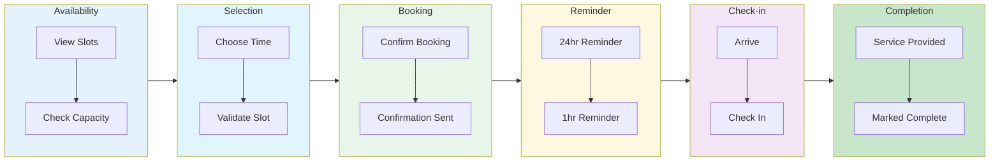

# Appointment Distribution

An **Appointment** is a distribution mechanism for scheduling time-based interactions. Appointments are ideal for in-store pickups, consultations, virtual meetings, or any scenario where consumers need dedicated time slots.

## Appointment Model

```typescript
interface Appointment {
  // Base Distribution Fields
  id: string;
  organizationId: string;
  sequenceId: string;
  name: string;
  openAt?: string;
  closeAt?: string;
  timeZone: string;
  supportsGuest: boolean;
  encryptionSeed: string;

  // Appointment-Specific Fields
  locationId?: string; // Physical location reference
  slotDurationMinutes?: number; // Length of each slot
  bufferMinutes?: number; // Gap between slots
  maxCapacityPerSlot?: number; // How many per slot

  // Audit
  createdAt: string;
  updatedAt: string;
  archived: boolean;
}
```

## How Appointments Work



```
┌────────────────────────────────────────────────────────────────────┐
│                      APPOINTMENT LIFECYCLE                          │
├────────────────────────────────────────────────────────────────────┤
│                                                                    │
│  AVAILABILITY          BOOKING              FULFILLMENT            │
│  ────────────          ───────              ───────────            │
│                                                                    │
│  ┌─────────────┐      ┌─────────────┐      ┌─────────────┐        │
│  │ View slots  │─────►│ Select slot │─────►│ Confirmation│        │
│  │ with        │      │ and book    │      │ + reminder  │        │
│  │ capacity    │      │             │      │             │        │
│  └─────────────┘      └─────────────┘      └──────┬──────┘        │
│                                                    │               │
│                                                    ▼               │
│                                             ┌─────────────┐        │
│                                             │  Check-in   │        │
│                                             │  at time    │        │
│                                             └──────┬──────┘        │
│                                                    │               │
│                                                    ▼               │
│                                             ┌─────────────┐        │
│                                             │  Completed  │        │
│                                             └─────────────┘        │
│                                                                    │
│  Slot Grid Example:                                                │
│  ┌────────┬────────┬────────┬────────┐                            │
│  │ 9:00am │ 9:30am │10:00am │10:30am │  ← Available slots         │
│  │  ○ ○   │  ● ○   │  ● ●   │  ○ ○   │  ← Capacity (2 per slot)  │
│  └────────┴────────┴────────┴────────┘                            │
│    Open     1 left    Full     Open                                │
│                                                                    │
└────────────────────────────────────────────────────────────────────┘
```

### Availability Phase

1. Consumer views available time slots
2. Slots show remaining capacity
3. Past slots are hidden
4. Buffer times create gaps between slots

### Booking Phase

1. Consumer selects an available slot
2. System validates capacity
3. Booking is confirmed
4. Consumer receives confirmation and reminders

### Fulfillment Phase

1. Consumer arrives and checks in
2. Appointment is marked completed
3. Analytics tracked for no-shows

## Consumer States

```typescript
const AppointmentConsumerStatus = {
  INITIALIZED: "initialized", // Started but not booked
  ENTERED: "entered", // Booked a slot
  CHECKED_IN: "checked_in", // Arrived and checked in
  COMPLETED: "completed", // Appointment completed
} as const;
```

### State Machine

```
┌─────────────────────────────────────────────────────────────────┐
│                 APPOINTMENT CONSUMER STATES                     │
├─────────────────────────────────────────────────────────────────┤
│                                                                 │
│  ┌─────────────┐                                               │
│  │ INITIALIZED │  (viewing slots, not booked)                  │
│  └──────┬──────┘                                               │
│         │ book()                                               │
│         ▼                                                      │
│  ┌─────────────┐                                               │
│  │   ENTERED   │  (slot booked)                                │
│  └──────┬──────┘                                               │
│         │                                                      │
│    ┌────┴────┐                                                 │
│    │         │                                                 │
│    ▼         ▼                                                 │
│ checkIn()  cancel()                                            │
│    │         │                                                 │
│    ▼         ▼                                                 │
│ ┌───────────┐  ┌───────────┐                                  │
│ │CHECKED_IN │  │ CANCELLED │                                  │
│ └─────┬─────┘  └───────────┘                                  │
│       │                                                        │
│       │ complete()                                             │
│       ▼                                                        │
│ ┌───────────┐                                                  │
│ │ COMPLETED │                                                  │
│ └───────────┘                                                  │
│                                                                 │
└─────────────────────────────────────────────────────────────────┘
```

## Appointment Consumer Model

```typescript
interface AppointmentConsumer {
  id: string;
  consumerId: string;
  appointmentId: string;

  // Status
  status: AppointmentConsumerStatus;

  // Timestamps
  enteredAt?: string; // When booked
  checkedInAt?: string; // When checked in
  completedAt?: string; // When completed
  cancelledAt?: string; // If cancelled
  cancellationReason?: string; // Why cancelled
  updatedAt?: string;

  // Slot info
  scheduledFor?: string; // The booked time slot
}
```

## Configuration Options

### Location

Associate appointment with a physical location:

```typescript
{
  locationId: "location-uuid"; // Reference to Location entity
}
```

**Location entity includes:**

- Name and address
- Operating hours
- Holiday schedules
- Capacity limits

### Slot Duration

Length of each appointment slot:

```typescript
{
  slotDurationMinutes: 30; // 30-minute slots
}

// Common values:
// 15 minutes - Quick consultations
// 30 minutes - Standard appointments
// 60 minutes - Extended sessions
```

### Buffer Time

Gap between slots for preparation:

```typescript
{
  bufferMinutes: 10; // 10-minute gap after each slot
}

// Effective schedule with 30min slots + 10min buffer:
// 9:00-9:30 (slot) → 9:30-9:40 (buffer) → 9:40-10:10 (slot)
```

### Capacity Per Slot

How many consumers can book the same slot:

```typescript
{
  maxCapacityPerSlot: 5; // 5 people per time slot
}

// Use cases:
// 1 - One-on-one consultations
// 5-10 - Group pickup windows
// 20+ - Large venue time blocks
```

## Slot Generation

Slots are generated from appointment configuration and location hours:

```typescript
interface TimeSlot {
  startTime: string; // ISO timestamp
  endTime: string; // ISO timestamp
  capacity: number; // Total capacity
  available: number; // Remaining capacity
  isAvailable: boolean; // Can be booked
}

// Example slot generation
function generateSlots(appointment: Appointment, location: Location, date: Date): TimeSlot[] {
  const hours = getOperatingHours(location, date);
  const slots: TimeSlot[] = [];

  let current = hours.open;
  while (current < hours.close) {
    const slotEnd = addMinutes(current, appointment.slotDurationMinutes);

    slots.push({
      startTime: current.toISOString(),
      endTime: slotEnd.toISOString(),
      capacity: appointment.maxCapacityPerSlot || 1,
      available: getAvailableCapacity(appointment.id, current),
      isAvailable: true,
    });

    // Add buffer
    current = addMinutes(slotEnd, appointment.bufferMinutes || 0);
  }

  return slots;
}
```

## SDK Usage

### Viewing Available Slots

```typescript
import { useFanfare } from "@waitify-io/fanfare-sdk-react";

function SlotPicker({ appointmentId }: { appointmentId: string }) {
  const { appointment } = useFanfare();
  const [date, setDate] = useState(new Date());
  const [slots, setSlots] = useState<TimeSlot[]>([]);

  useEffect(() => {
    const loadSlots = async () => {
      const available = await appointment.getAvailableSlots(appointmentId, date);
      setSlots(available);
    };
    loadSlots();
  }, [appointmentId, date]);

  return (
    <div>
      <DatePicker value={date} onChange={setDate} />

      <div className="slots-grid">
        {slots.map((slot) => (
          <button
            key={slot.startTime}
            disabled={!slot.isAvailable}
            onClick={() => handleSelectSlot(slot)}
          >
            {formatTime(slot.startTime)}
            {slot.available > 1 && ` (${slot.available} spots)`}
          </button>
        ))}
      </div>
    </div>
  );
}
```

### Booking an Appointment

```typescript
function BookingConfirmation({ appointmentId, slot }: Props) {
  const { appointment } = useFanfare();
  const [booking, setBooking] = useState<Booking | null>(null);

  const handleBook = async () => {
    try {
      const result = await appointment.book(appointmentId, {
        slotTime: slot.startTime
      });
      setBooking(result);
    } catch (error) {
      if (error.code === "SLOT_FULL") {
        // Handle slot no longer available
      }
    }
  };

  if (booking) {
    return (
      <div>
        <h2>Appointment Confirmed!</h2>
        <p>Time: {formatDateTime(booking.scheduledFor)}</p>
        <p>Location: {booking.locationName}</p>
        <p>Confirmation: {booking.confirmationCode}</p>
      </div>
    );
  }

  return (
    <div>
      <p>Book for {formatDateTime(slot.startTime)}?</p>
      <button onClick={handleBook}>Confirm Booking</button>
    </div>
  );
}
```

### Check-in

```typescript
function CheckIn({ appointmentId }: { appointmentId: string }) {
  const { appointment } = useFanfare();

  const handleCheckIn = async () => {
    await appointment.checkIn(appointmentId);
  };

  return (
    <button onClick={handleCheckIn}>
      Check In
    </button>
  );
}
```

## API Operations

### Create Appointment

```bash
POST /v1/sequences/:sequenceId/appointments
Authorization: Bearer sk_live_...
Content-Type: application/json

{
  "name": "In-Store Pickup",
  "openAt": "2024-03-01T00:00:00Z",
  "closeAt": "2024-03-31T23:59:59Z",
  "timeZone": "America/New_York",
  "locationId": "location-uuid",
  "slotDurationMinutes": 15,
  "bufferMinutes": 5,
  "maxCapacityPerSlot": 10,
  "supportsGuest": false
}
```

### Get Available Slots

```bash
GET /v1/appointments/:id/slots?date=2024-03-15
Authorization: Bearer sk_live_...

# Response
{
  "appointmentId": "appointment-uuid",
  "date": "2024-03-15",
  "slots": [
    {
      "startTime": "2024-03-15T09:00:00-05:00",
      "endTime": "2024-03-15T09:15:00-05:00",
      "capacity": 10,
      "available": 8
    },
    {
      "startTime": "2024-03-15T09:20:00-05:00",
      "endTime": "2024-03-15T09:35:00-05:00",
      "capacity": 10,
      "available": 10
    }
  ]
}
```

### Consumer Book Slot

```bash
POST /consumers/v1/appointments/:appointmentId/book
Authorization: Bearer consumer-token
Content-Type: application/json

{
  "slotTime": "2024-03-15T09:00:00-05:00"
}

# Response
{
  "status": "entered",
  "scheduledFor": "2024-03-15T09:00:00-05:00",
  "confirmationCode": "APT-123456",
  "location": {
    "name": "Main Street Store",
    "address": "123 Main St, New York, NY"
  }
}
```

### Consumer Check In

```bash
POST /consumers/v1/appointments/:appointmentId/check-in
Authorization: Bearer consumer-token

# Response
{
  "status": "checked_in",
  "checkedInAt": "2024-03-15T08:55:00-05:00"
}
```

### Consumer Cancel

```bash
POST /consumers/v1/appointments/:appointmentId/cancel
Authorization: Bearer consumer-token
Content-Type: application/json

{
  "reason": "Schedule conflict"
}

# Response
{
  "status": "cancelled",
  "cancelledAt": "2024-03-14T10:00:00-05:00"
}
```

## Notifications

### Confirmation

Sent immediately after booking:

```typescript
{
  type: "APPOINTMENT_CONFIRMED",
  scheduledFor: "2024-03-15T09:00:00-05:00",
  location: { name, address },
  confirmationCode: "APT-123456"
}
```

### Reminders

Sent before appointment:

```typescript
// 24 hours before
{
  type: "APPOINTMENT_REMINDER",
  scheduledFor: "2024-03-15T09:00:00-05:00",
  hoursUntil: 24
}

// 1 hour before
{
  type: "APPOINTMENT_REMINDER",
  scheduledFor: "2024-03-15T09:00:00-05:00",
  hoursUntil: 1
}
```

## Best Practices

### 1. Account for No-Shows

Expect some percentage won't arrive:

```typescript
// Overbook slightly for high no-show rates
{
  maxCapacityPerSlot: 12; // If 10 is target, book 12
}
```

### 2. Set Appropriate Buffers

Allow time for:

- Consumer late arrival
- Staff preparation
- Cleaning between appointments

```typescript
{
  slotDurationMinutes: 30,
  bufferMinutes: 10  // 25% buffer
}
```

### 3. Require Authentication

Appointments need accountability:

```typescript
{
  supportsGuest: false; // Must be authenticated
}
```

### 4. Send Reminders

Multiple reminders reduce no-shows:

- 24 hours before
- 2 hours before (for same-day)
- On arrival (check-in prompt)

### 5. Allow Cancellation

Make it easy to cancel:

- Clear cancellation policy
- Reasonable deadline
- Freed slot becomes available

## Common Patterns

### In-Store Pickup

```typescript
{
  name: "Curbside Pickup",
  slotDurationMinutes: 15,
  bufferMinutes: 0,  // Back-to-back OK
  maxCapacityPerSlot: 20,
  supportsGuest: false
}
```

### One-on-One Consultation

```typescript
{
  name: "Personal Shopping",
  slotDurationMinutes: 60,
  bufferMinutes: 15,
  maxCapacityPerSlot: 1,  // Exclusive slot
  supportsGuest: false
}
```

### Group Event Time Block

```typescript
{
  name: "VIP Preview Hour",
  slotDurationMinutes: 120,
  bufferMinutes: 30,
  maxCapacityPerSlot: 50,
  supportsGuest: false
}
```

## Related Concepts

- [Distributions Overview](/docs/concepts/distributions/overview) - Common distribution concepts
- [Queue Distribution](/docs/concepts/distributions/queue) - Alternative flow control
- [Real-Time Updates](/docs/concepts/real-time) - Slot availability updates
