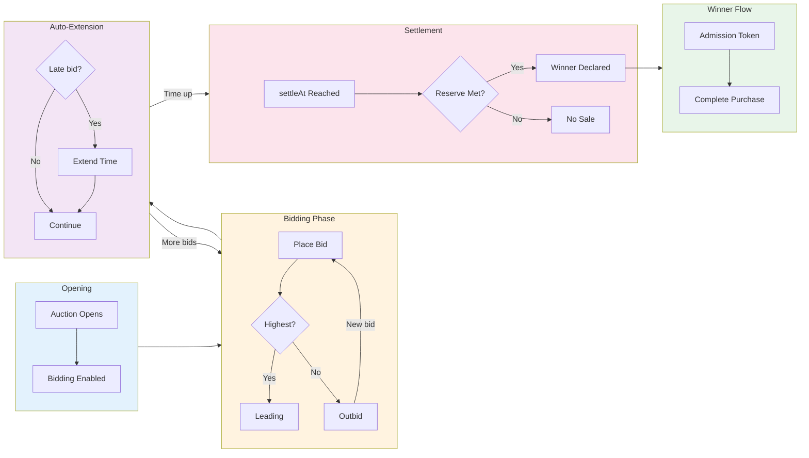

# Auction Distribution

An **Auction** is a distribution mechanism that allocates products through competitive bidding. Auctions are ideal for limited items where price discovery is desirable or when scarcity drives value.

## Auction Model

```typescript
interface Auction {
  // Base Distribution Fields
  id: string;
  organizationId: string;
  sequenceId: string;
  name: string;
  openAt?: string;
  closeAt?: string;
  timeZone: string;
  supportsGuest: boolean;
  encryptionSeed: string;

  // Auction-Specific Fields
  settleAt: string; // When auction ends and winner is determined
  reservePrice?: string; // Minimum price to sell (decimal string)
  minBidIncrement?: string; // Minimum bid increase (decimal string)
  autoExtendSeconds?: number; // Extend if bid in final seconds

  // Audit
  createdAt: string;
  updatedAt: string;
  archived: boolean;
}
```

## How Auctions Work



```
┌────────────────────────────────────────────────────────────────────┐
│                        AUCTION LIFECYCLE                            │
├────────────────────────────────────────────────────────────────────┤
│                                                                    │
│   BIDDING PERIOD                                   SETTLEMENT      │
│   ──────────────                                   ──────────      │
│                                                                    │
│  ┌────────┐                                       ┌────────┐      │
│  │ openAt │                                       │settleAt│      │
│  └───┬────┘                                       └───┬────┘      │
│      │                                                │           │
│  ────┼────────────────────────────────────────────────┼────►      │
│      │                                                │           │
│      ▼                                                ▼           │
│  Bidding opens                                   Highest bid wins │
│      │                                                │           │
│      ▼                                                │           │
│  ┌──────────────────────┐    ┌──────────────────┐    │           │
│  │ $100 → $120 → $150   │    │ Auto-extend      │    │           │
│  │ Bids accumulate      │◄──►│ if bid in last   │    │           │
│  │                      │    │ N seconds        │    │           │
│  └──────────────────────┘    └──────────────────┘    │           │
│                                                       │           │
│                              Reserve met?             │           │
│                              ├── Yes → Winner!        │           │
│                              └── No → No sale         │           │
│                                                                    │
└────────────────────────────────────────────────────────────────────┘
```

### Bidding Phase

1. Auction opens at `openAt` timestamp
2. Consumers place bids (must exceed current highest + `minBidIncrement`)
3. Current highest bid is visible to all bidders
4. If `autoExtendSeconds` is set, late bids extend the auction

### Settlement Phase

1. At `settleAt`, bidding closes
2. Highest bidder wins (if bid >= `reservePrice`)
3. Winner receives admission token
4. Non-winners are notified

## Consumer States

```typescript
const AuctionConsumerStatus = {
  BIDDING: "BIDDING", // Has active bid, not winning
  OUTBID: "OUTBID", // Was winning, now outbid
  BID_WON: "BID_WON", // Won the auction
  BID_LOST: "BID_LOST", // Auction ended, did not win
  AUCTION_ENDED: "AUCTION_ENDED", // Auction ended (generic)
  RESERVE_MET: "RESERVE_MET", // Reserve price met by bid
  AUCTION_EXTENDED: "AUCTION_EXTENDED", // Auction time extended
} as const;
```

### State Machine

```
┌─────────────────────────────────────────────────────────────────┐
│                  AUCTION CONSUMER STATES                        │
├─────────────────────────────────────────────────────────────────┤
│                                                                 │
│  ┌─────────────┐                                               │
│  │ NOT_BIDDING │                                               │
│  └──────┬──────┘                                               │
│         │ placeBid()                                           │
│         ▼                                                      │
│  ┌─────────────┐     outbid      ┌────────┐                   │
│  │   BIDDING   │◄───────────────►│ OUTBID │                   │
│  │  (winning)  │    newHighBid   │        │                   │
│  └──────┬──────┘                 └────┬───┘                   │
│         │                             │                        │
│         │ settlement                  │ settlement             │
│         │                             │                        │
│    ┌────┴────┐                        │                        │
│    ▼         ▼                        ▼                        │
│ ┌───────┐ ┌──────────┐           ┌──────────┐                 │
│ │BID_WON│ │ BID_LOST │           │ BID_LOST │                 │
│ └───┬───┘ │(reserve  │           └──────────┘                 │
│     │     │ not met) │                                        │
│     │     └──────────┘                                        │
│     │                                                          │
│     │ complete()                                               │
│     ▼                                                          │
│ ┌──────────┐                                                   │
│ │COMPLETED │                                                   │
│ └──────────┘                                                   │
│                                                                 │
└─────────────────────────────────────────────────────────────────┘
```

## Auction Consumer Model

```typescript
interface AuctionConsumer {
  id: string;
  consumerId: string;
  auctionId: string;
  sequenceId: string;

  // Status
  status: AuctionConsumerStatus;

  // Bidding
  bidAmount?: string; // Current bid amount

  // Timestamps
  enteredAt?: string; // When first bid placed
  lastBidAt?: string; // Most recent bid time
  notifiedAt?: string; // When notified of result
  completedAt?: string; // When purchase completed
  updatedAt?: string;
}
```

## Configuration Options

### Settlement Time

When the auction ends:

```typescript
{
  settleAt: "2024-03-01T12:00:00Z"; // Auction ends at noon UTC
}

// Must be after openAt
// closeAt usually equals settleAt
```

### Reserve Price

Minimum price to complete sale:

```typescript
{
  reservePrice: "500.00"; // Must bid at least $500 to win
}

// null = no reserve (any bid wins)
{
  reservePrice: null;
}
```

**Behavior when reserve not met:**

- Auction ends with no winner
- Bidders notified of result
- Item remains unsold

### Minimum Bid Increment

Required increase over current bid:

```typescript
{
  minBidIncrement: "10.00"; // Each bid must be $10+ higher
}

// null = any increase accepted
{
  minBidIncrement: null;
}
```

**Strategy:**

- Higher increments = faster price discovery
- Lower increments = more competitive bidding

### Auto-Extend

Prevent sniping by extending auction on late bids:

```typescript
{
  autoExtendSeconds: 120; // Extend by 2 min if bid in last 2 min
}

// null = no extension
{
  autoExtendSeconds: null;
}
```

**How it works:**

1. Bid placed within `autoExtendSeconds` of `settleAt`
2. Settlement time extends by `autoExtendSeconds`
3. Can extend multiple times
4. Gives all bidders fair chance to respond

## Bidding Logic

### Bid Validation

```typescript
function validateBid(auction: Auction, currentHighBid: string | null, newBid: string): ValidationResult {
  const newBidAmount = parseDecimal(newBid);

  // Check auction is open
  if (new Date() > new Date(auction.settleAt)) {
    return { valid: false, reason: "AUCTION_ENDED" };
  }

  // Check against current high bid
  if (currentHighBid) {
    const minRequired = parseDecimal(currentHighBid) + parseDecimal(auction.minBidIncrement || "0.01");
    if (newBidAmount < minRequired) {
      return { valid: false, reason: "BID_TOO_LOW", minimum: minRequired };
    }
  }

  // Check against reserve (informational)
  const meetsReserve = !auction.reservePrice || newBidAmount >= parseDecimal(auction.reservePrice);

  return { valid: true, meetsReserve };
}
```

### Real-Time Updates

Bidders receive real-time updates:

```typescript
type AuctionEvent =
  | { type: "NEW_HIGH_BID"; amount: string; timestamp: string }
  | { type: "OUTBID"; newHighBid: string }
  | { type: "AUCTION_EXTENDED"; newSettleAt: string }
  | { type: "AUCTION_ENDED"; winner: boolean; finalBid: string };
```

## SDK Usage

### Placing a Bid

```typescript
import { useFanfare } from "@waitify-io/fanfare-sdk-react";

function AuctionBidding({ auctionId }: { auctionId: string }) {
  const { auction } = useFanfare();
  const [bidAmount, setBidAmount] = useState("");
  const [error, setError] = useState<string | null>(null);

  const handleBid = async () => {
    try {
      await auction.placeBid(auctionId, bidAmount);
      setBidAmount("");
      setError(null);
    } catch (err) {
      if (err.code === "BID_TOO_LOW") {
        setError(`Minimum bid is ${err.minimum}`);
      } else {
        setError(err.message);
      }
    }
  };

  return (
    <div>
      <input
        type="number"
        value={bidAmount}
        onChange={(e) => setBidAmount(e.target.value)}
        placeholder="Enter bid amount"
      />
      <button onClick={handleBid}>Place Bid</button>
      {error && <p className="error">{error}</p>}
    </div>
  );
}
```

### Monitoring Auction Status

```typescript
function AuctionStatus({ auctionId }: { auctionId: string }) {
  const { auction } = useFanfare();
  const [state, setState] = useState<AuctionState | null>(null);

  useEffect(() => {
    // Subscribe to auction updates
    const unsubscribe = auction.subscribe(auctionId, setState);
    return unsubscribe;
  }, [auctionId]);

  if (!state) return <div>Loading...</div>;

  return (
    <div>
      <p>Current Bid: {state.currentBid || "No bids yet"}</p>
      <p>Your Status: {state.status}</p>
      <p>Time Remaining: {formatTimeRemaining(state.settleAt)}</p>

      {state.status === "OUTBID" && (
        <p className="warning">You've been outbid! Place a higher bid.</p>
      )}

      {state.status === "BID_WON" && (
        <a href={`/checkout?token=${state.admissionToken}`}>
          Complete Purchase
        </a>
      )}
    </div>
  );
}
```

## API Operations

### Create Auction

```bash
POST /v1/sequences/:sequenceId/auctions
Authorization: Bearer sk_live_...
Content-Type: application/json

{
  "name": "Limited Edition Watch Auction",
  "openAt": "2024-03-01T09:00:00Z",
  "settleAt": "2024-03-01T17:00:00Z",
  "closeAt": "2024-03-01T17:00:00Z",
  "timeZone": "America/New_York",
  "reservePrice": "1000.00",
  "minBidIncrement": "25.00",
  "autoExtendSeconds": 180,
  "supportsGuest": false
}
```

### Get Auction Status

```bash
GET /v1/auctions/:id
Authorization: Bearer sk_live_...

# Response
{
  "id": "auction-uuid",
  "name": "Limited Edition Watch Auction",
  "status": "open",
  "currentHighBid": "1450.00",
  "bidderCount": 12,
  "reserveMet": true,
  "settleAt": "2024-03-01T17:00:00Z",
  "autoExtendSeconds": 180
}
```

### Consumer Place Bid

```bash
POST /consumers/v1/auctions/:auctionId/bid
Authorization: Bearer consumer-token
Content-Type: application/json

{
  "amount": "1500.00"
}

# Response (success)
{
  "status": "BIDDING",
  "bidAmount": "1500.00",
  "isHighBidder": true,
  "timestamp": "2024-03-01T14:30:00Z"
}

# Response (outbid)
{
  "status": "OUTBID",
  "bidAmount": "1450.00",
  "currentHighBid": "1500.00",
  "minNextBid": "1525.00"
}
```

### Consumer Get Status

```bash
GET /consumers/v1/auctions/:auctionId/status
Authorization: Bearer consumer-token

# Response (during auction)
{
  "status": "BIDDING",
  "bidAmount": "1500.00",
  "isHighBidder": true,
  "currentHighBid": "1500.00",
  "timeRemaining": 3600
}

# Response (won)
{
  "status": "BID_WON",
  "winningBid": "1500.00",
  "admissionToken": "eyJ...",
  "expiresAt": "2024-03-01T18:00:00Z"
}
```

## Best Practices

### 1. Set Appropriate Reserves

Balance seller protection with buyer engagement:

```typescript
// Too high: No bids, auction fails
// Too low: Undersells valuable items
// Right: Based on market research

reservePrice: marketValue * 0.7; // 70% of expected value
```

### 2. Use Auto-Extend

Prevent last-second sniping:

```typescript
{
  autoExtendSeconds: 120; // 2-minute extension on late bids
}
```

### 3. Choose Bid Increments Wisely

```typescript
// High-value items: Larger increments
{
  minBidIncrement: "100.00"; // For items $1000+
}

// Lower-value items: Smaller increments
{
  minBidIncrement: "5.00"; // For items under $100
}
```

### 4. Require Authentication

Auctions involve payment commitment:

```typescript
{
  supportsGuest: false; // Must be authenticated to bid
}
```

### 5. Communicate Clearly

Show bidders:

- Current high bid
- Minimum next bid
- Time remaining
- Reserve status (met/not met)
- Extension notifications

## Common Patterns

### Standard Single-Item Auction

```typescript
{
  name: "Rare Collectible Auction",
  openAt: "2024-03-01T09:00:00Z",
  settleAt: "2024-03-07T21:00:00Z",
  reservePrice: "500.00",
  minBidIncrement: "25.00",
  autoExtendSeconds: 300,
  supportsGuest: false
}
```

### Flash Auction

Short duration, no reserve:

```typescript
{
  name: "Flash Auction - 1 Hour",
  openAt: "2024-03-01T12:00:00Z",
  settleAt: "2024-03-01T13:00:00Z",
  reservePrice: null,
  minBidIncrement: "10.00",
  autoExtendSeconds: 60,
  supportsGuest: false
}
```

### Charity Auction

Higher starting price, longer duration:

```typescript
{
  name: "Charity Gala Auction",
  openAt: "2024-03-01T00:00:00Z",
  settleAt: "2024-03-14T23:59:59Z",
  reservePrice: "1000.00",  // Starting bid
  minBidIncrement: "50.00",
  autoExtendSeconds: null,  // No extension
  supportsGuest: false
}
```

## Currency Handling

Auctions use the organization's currency:

```typescript
// All monetary values are decimal strings
{
  reservePrice: "1000.00",
  minBidIncrement: "25.00",
  // Currency from organization: "USD"
}

// Displayed as: $1,000.00, $25.00
```

## Related Concepts

- [Distributions Overview](/docs/concepts/distributions/overview) - Common distribution concepts
- [Draw Distribution](/docs/concepts/distributions/lottery) - Alternative fair allocation
- [Products](/docs/concepts/products) - Pricing and inventory
