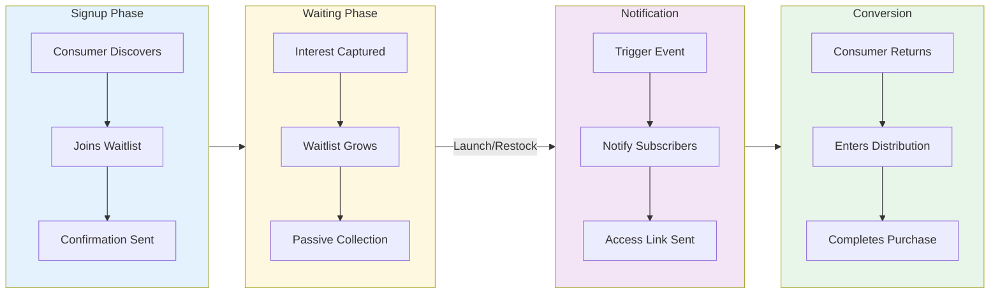

# Waitlist Distribution

A **Waitlist** is a distribution mechanism for capturing interest and notifying consumers when access becomes available. Unlike other distributions that actively allocate access, waitlists are passive collectors that integrate with other distribution types.

## Waitlist Model

```typescript
interface Waitlist {
  // Base Fields
  id: string;
  organizationId: string;
  sequenceId: string; // Parent sequence

  // Configuration
  capacity?: number; // Max waitlist size

  // Audit
  createdAt: string;
  updatedAt: string;
  archived: boolean;
}
```

Note: Waitlists are simpler than other distributions - they don't have `openAt`/`closeAt` timing as they're typically always available within a sequence.

## How Waitlists Work



```
┌────────────────────────────────────────────────────────────────────┐
│                       WAITLIST LIFECYCLE                            │
├────────────────────────────────────────────────────────────────────┤
│                                                                    │
│   INTEREST CAPTURE         WAITING            CONVERSION           │
│   ────────────────         ───────            ──────────           │
│                                                                    │
│   ┌──────────────┐       ┌──────────────┐    ┌──────────────┐     │
│   │ Consumer     │──────►│   Waitlist   │───►│ Distribution │     │
│   │ signs up     │       │   (passive)  │    │   opens      │     │
│   └──────────────┘       └──────────────┘    └──────────────┘     │
│                                │                    │              │
│                                │                    ▼              │
│                                │              ┌──────────────┐     │
│                                │              │ Notification │     │
│                                │              │    sent      │     │
│                                │              └──────────────┘     │
│                                │                    │              │
│                                │                    ▼              │
│                                │              ┌──────────────┐     │
│                                └─────────────►│  Consumer    │     │
│                                               │  converts    │     │
│                                               └──────────────┘     │
│                                                                    │
│   Use Cases:                                                       │
│   • Pre-launch interest: "Notify me when available"               │
│   • Overflow handling: Queue full → join waitlist                 │
│   • Restock alerts: Out of stock → notify when back               │
│                                                                    │
└────────────────────────────────────────────────────────────────────┘
```

### Signup Phase

1. Consumer discovers upcoming experience or sold-out product
2. Consumer joins waitlist with email/phone
3. System confirms signup

### Waiting Phase

1. Consumers accumulate on waitlist
2. No position or ordering (unlike queues)
3. Waitlist remains passive until trigger event

### Conversion Phase

1. Trigger event occurs (launch, restock, availability)
2. All waitlist members notified
3. Consumers convert through available distribution

## Waitlist vs Other Distributions

| Aspect                | Waitlist         | Queue              | Draw           |
| --------------------- | ---------------- | ------------------ | -------------- |
| **Purpose**           | Capture interest | Manage access flow | Fair selection |
| **Active allocation** | No               | Yes                | Yes            |
| **Position matters**  | No               | Yes                | No             |
| **Guarantees access** | No               | Position-based     | Random chance  |
| **Typical trigger**   | External event   | Entry flow         | Scheduled time |

## Waitlist Consumer Model

```typescript
interface WaitlistConsumer {
  id: string;
  consumerId: string;
  waitlistId: string;

  // Status
  status: string; // "WAITING", "NOTIFIED", "CONVERTED"

  // Timestamps
  enteredAt: string; // When joined waitlist
  notifiedAt?: string; // When notification sent
  convertedAt?: string; // When completed conversion
  updatedAt?: string;
}
```

## Use Cases

### Pre-Launch Interest

Capture interest before a product launches:

```typescript
// Sequence setup for upcoming launch
{
  name: "Product Launch",
  waitlist: {
    capacity: null  // Unlimited signups
  },
  // Queue/draw added closer to launch
}
```

**Consumer journey:**

1. See "Coming Soon" page
2. Sign up for waitlist
3. Receive launch notification
4. Join queue/draw when it opens

### Overflow Handling

When primary distribution is at capacity:

```typescript
// Sequence with queue + waitlist fallback
{
  name: "High Demand Sale",
  queues: [{
    name: "Main Queue",
    capacity: 10000  // Limited queue size
  }],
  waitlist: {
    // Overflow goes here
  }
}
```

**Consumer journey:**

1. Try to join queue
2. Queue is full
3. Offered waitlist instead
4. Notified if spots open

### Restock Notifications

Alert consumers when out-of-stock items return:

```typescript
// For sold-out products
{
  name: "Restock Alert",
  waitlist: {
    capacity: null
  }
  // TimedRelease created when inventory added
}
```

**Consumer journey:**

1. See "Sold Out"
2. Sign up for restock notification
3. Receive alert when restocked
4. Immediate access to purchase

## SDK Usage

### Joining a Waitlist

```typescript
import { useFanfare } from "@waitify-io/fanfare-sdk-react";

function WaitlistSignup({ waitlistId }: { waitlistId: string }) {
  const { waitlist } = useFanfare();
  const [joined, setJoined] = useState(false);
  const [email, setEmail] = useState("");

  const handleJoin = async () => {
    try {
      await waitlist.join(waitlistId, { email });
      setJoined(true);
    } catch (error) {
      console.error("Failed to join:", error);
    }
  };

  if (joined) {
    return (
      <div>
        <h3>You're on the list!</h3>
        <p>We'll notify you at {email} when it's available.</p>
      </div>
    );
  }

  return (
    <div>
      <h3>Notify Me</h3>
      <input
        type="email"
        value={email}
        onChange={(e) => setEmail(e.target.value)}
        placeholder="Enter your email"
      />
      <button onClick={handleJoin}>Join Waitlist</button>
    </div>
  );
}
```

### Checking Waitlist Status

```typescript
function WaitlistStatus({ waitlistId }: { waitlistId: string }) {
  const { waitlist } = useFanfare();
  const [status, setStatus] = useState<WaitlistStatus | null>(null);

  useEffect(() => {
    waitlist.getStatus(waitlistId).then(setStatus);
  }, [waitlistId]);

  if (!status) return null;

  switch (status.status) {
    case "WAITING":
      return <p>You're on the waitlist. We'll notify you!</p>;

    case "NOTIFIED":
      return (
        <div>
          <p>It's available now!</p>
          <a href={status.conversionUrl}>Get Access</a>
        </div>
      );

    case "CONVERTED":
      return <p>You've already converted!</p>;

    default:
      return null;
  }
}
```

## API Operations

### Create Waitlist

```bash
POST /v1/sequences/:sequenceId/waitlists
Authorization: Bearer sk_live_...
Content-Type: application/json

{
  "capacity": 50000
}

# Or unlimited
{
  "capacity": null
}
```

### Get Waitlist

```bash
GET /v1/waitlists/:id
Authorization: Bearer sk_live_...

# Response
{
  "id": "waitlist-uuid",
  "sequenceId": "sequence-uuid",
  "capacity": 50000,
  "subscriberCount": 12500
}
```

### Consumer Join Waitlist

```bash
POST /consumers/v1/waitlists/:waitlistId/join
Authorization: Bearer consumer-token
Content-Type: application/json

{
  "email": "user@example.com"
}

# Response
{
  "status": "WAITING",
  "enteredAt": "2024-02-15T10:00:00Z",
  "position": null  // No position tracking
}
```

### Consumer Leave Waitlist

```bash
POST /consumers/v1/waitlists/:waitlistId/leave
Authorization: Bearer consumer-token

# Response
{
  "status": "LEFT",
  "leftAt": "2024-02-16T10:00:00Z"
}
```

### Notify Waitlist (Admin)

```bash
POST /v1/waitlists/:id/notify
Authorization: Bearer sk_live_...
Content-Type: application/json

{
  "message": "The product is now available!",
  "actionUrl": "https://shop.example.com/product",
  "expiresAt": "2024-03-02T00:00:00Z"
}

# Response
{
  "notifiedCount": 12500,
  "notifiedAt": "2024-03-01T12:00:00Z"
}
```

## Notification Strategies

### Blast Notification

Notify all waitlist members at once:

```typescript
// All subscribers notified simultaneously
await api.waitlists.notify(waitlistId, {
  message: "Product is now available!",
  actionUrl: "/shop",
});
```

**Best for:**

- Product launches (high inventory)
- Flash sales with ample stock
- Unlimited access events

### Batched Notification

Notify in waves to manage traffic:

```typescript
// Notify in batches
await api.waitlists.notify(waitlistId, {
  message: "You have early access!",
  batchSize: 1000,
  batchIntervalMinutes: 5,
});
```

**Best for:**

- Limited inventory
- Capacity-constrained systems
- Fairness in limited scenarios

### Priority Notification

Notify based on signup time or attributes:

```typescript
// VIP waitlist members first
await api.waitlists.notify(waitlistId, {
  audienceFilter: "vip-audience",
  message: "VIP early access is live!",
});

// Then general waitlist
await api.waitlists.notify(waitlistId, {
  excludeAudience: "vip-audience",
  message: "General access is now open!",
});
```

## Best Practices

### 1. Always Collect Contact Info

Waitlists require a way to notify:

```typescript
// Minimum: email OR phone
{
  supportsGuest: false; // Must provide contact
}

// Best: verified contact
// Send confirmation email/SMS on signup
```

### 2. Set Expectations

Be clear about what joining means:

```
Join our waitlist to be notified when this drops.
You'll receive one email when it's available.
```

### 3. Easy Unsubscribe

Always provide opt-out:

```typescript
// Include in every notification
{
  unsubscribeUrl: "/waitlist/leave?token=...";
}
```

### 4. Time-Bound Access

Give notified users a reasonable window:

```typescript
// Notification with expiry
{
  message: "Your exclusive access expires in 24 hours",
  expiresAt: "2024-03-02T12:00:00Z"
}
```

### 5. Track Conversion

Monitor waitlist effectiveness:

```typescript
// Key metrics
const metrics = {
  signupCount: 10000,
  notifiedCount: 10000,
  convertedCount: 2500,
  conversionRate: 0.25, // 25% converted
};
```

## Integration Patterns

### Waitlist → Queue

```typescript
// When launch day arrives
async function launchExperience(experienceId: string) {
  // 1. Create the queue
  const queue = await api.queues.create({
    sequenceId,
    admitRate: 100,
    openAt: launchTime,
  });

  // 2. Notify waitlist
  await api.waitlists.notify(waitlistId, {
    message: "The queue is now open!",
    actionUrl: `/experience/${experienceId}`,
  });

  // 3. Waitlist members join queue at their convenience
}
```

### Waitlist → Draw

```typescript
// Convert waitlist to draw entries
async function openDraw(experienceId: string) {
  // 1. Create draw
  const draw = await api.draws.create({
    sequenceId,
    drawAt: drawTime,
    winnerCount: 100,
  });

  // 2. Notify waitlist of draw opening
  await api.waitlists.notify(waitlistId, {
    message: "Enter the draw now for a chance to win!",
    actionUrl: `/experience/${experienceId}/draw`,
  });
}
```

### Waitlist → Timed Release

```typescript
// Direct access at scheduled time
async function scheduleRelease(experienceId: string) {
  // 1. Create timed release
  const release = await api.timedReleases.create({
    sequenceId,
    openAt: releaseTime,
  });

  // 2. Notify waitlist with countdown
  await api.waitlists.notify(waitlistId, {
    message: `Dropping ${formatDate(releaseTime)}!`,
    actionUrl: `/experience/${experienceId}`,
  });
}
```

## Common Patterns

### Coming Soon Page

```typescript
// Minimal waitlist for pre-launch
{
  experience: {
    name: "New Product",
    openAt: null,  // Not yet set
    sequences: [{
      name: "Interest List",
      waitlist: { capacity: null }
    }]
  }
}
```

### Sold Out Fallback

```typescript
// When inventory depletes
if (product.inventoryQuantity === 0) {
  // Show waitlist signup
  return <WaitlistSignup
    waitlistId={sequence.waitlist.id}
    message="Notify me when back in stock"
  />;
}
```

### VIP Pre-Registration

```typescript
// Tiered waitlist access
{
  sequences: [
    {
      name: "VIP Waitlist",
      priority: 100,
      audienceId: "vip-members",
      waitlist: {},
    },
    {
      name: "General Waitlist",
      priority: 0,
      waitlist: {},
    },
  ];
}
```

## Related Concepts

- [Distributions Overview](/docs/concepts/distributions/overview) - Common distribution concepts
- [Timed Release](/docs/concepts/distributions/instant) - For instant access at scheduled time
- [Queue Distribution](/docs/concepts/distributions/queue) - For managing flow after waitlist
- [Audiences](/docs/concepts/audiences) - For segmented waitlist notifications
