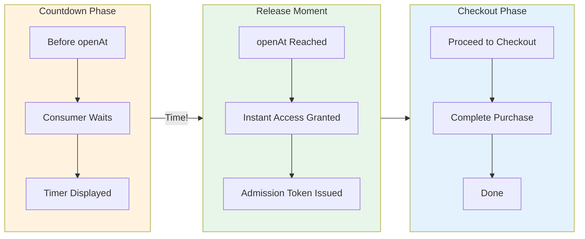

# Timed Release Distribution

A **Timed Release** is a distribution mechanism that grants instant access at a scheduled time. Unlike queues or draws, there's no waiting or selection process - when the release opens, everyone gets access simultaneously.

## Timed Release Model

```typescript
interface TimedRelease {
  // Base Distribution Fields
  id: string;
  organizationId: string;
  sequenceId: string;
  name: string;
  openAt?: string; // When access begins
  closeAt?: string; // When access ends
  timeZone: string;
  supportsGuest: boolean;
  encryptionSeed: string;

  // No additional fields - simplest distribution type

  // Audit
  createdAt: string;
  updatedAt: string;
  archived: boolean;
}
```

## How Timed Releases Work



```
┌────────────────────────────────────────────────────────────────────┐
│                     TIMED RELEASE LIFECYCLE                         │
├────────────────────────────────────────────────────────────────────┤
│                                                                    │
│    BEFORE openAt          AT openAt              DURING WINDOW     │
│    ──────────────         ─────────              ─────────────     │
│                                                                    │
│    ┌──────────┐          ┌──────────┐           ┌──────────┐      │
│    │ Countdown│──────────►│  OPEN!   │──────────►│ Checkout │      │
│    │          │   time   │          │  instant  │          │      │
│    │  3:00:00 │          │ Access   │  access   │ Complete │      │
│    │  2:59:59 │          │ Granted  │           │ purchase │      │
│    │  2:59:58 │          │          │           │          │      │
│    │    ...   │          │          │           │          │      │
│    └──────────┘          └──────────┘           └──────────┘      │
│                                                                    │
│    Consumer sees         All waiting            Standard          │
│    countdown timer       consumers get          checkout flow     │
│                          immediate access                         │
│                                                                    │
│    ───────────────────────────────────────────────────────────►   │
│              openAt                   closeAt                      │
│                                                                    │
└────────────────────────────────────────────────────────────────────┘
```

### Pre-Release Phase

1. Consumers arrive and see countdown to `openAt`
2. Optionally join waitlist to be notified
3. Build anticipation for the drop

### Release Moment

1. Clock hits `openAt`
2. All waiting consumers immediately receive access
3. Checkout becomes available

### Access Window

1. Consumers have until `closeAt` to complete
2. Inventory may sell out before `closeAt`
3. Standard checkout flow applies

## Use Cases

Timed releases are ideal for:

| Scenario             | Why Timed Release?                 |
| -------------------- | ---------------------------------- |
| Flash sale           | Everyone gets fair shot at opening |
| Member-only drop     | Reward loyalty with instant access |
| Product launch       | Maximum excitement at drop time    |
| Limited offer        | Time-bound urgency                 |
| Restock notification | Immediate access for waiters       |

## Consumer Flow

Unlike other distributions, there's no status progression during participation:

```typescript
// Before openAt
{
  status: "waiting",
  opensAt: "2024-03-01T12:00:00Z",
  countdown: 3600  // seconds remaining
}

// At/after openAt
{
  status: "open",
  admissionToken: "eyJ...",
  checkoutUrl: "/checkout?token=..."
}

// After closeAt
{
  status: "closed"
}
```

## SDK Usage

### Countdown Display

```typescript
import { useFanfare } from "@waitify-io/fanfare-sdk-react";
import { useState, useEffect } from "react";

function TimedReleaseCountdown({ releaseId }: { releaseId: string }) {
  const { timedRelease } = useFanfare();
  const [state, setState] = useState<TimedReleaseState | null>(null);
  const [countdown, setCountdown] = useState<number | null>(null);

  useEffect(() => {
    // Get initial state
    timedRelease.get(releaseId).then(setState);

    // Subscribe to state changes
    const unsub = timedRelease.subscribe(releaseId, setState);
    return unsub;
  }, [releaseId]);

  useEffect(() => {
    if (!state?.opensAt) return;

    const interval = setInterval(() => {
      const remaining = Math.max(0,
        new Date(state.opensAt).getTime() - Date.now()
      );
      setCountdown(Math.floor(remaining / 1000));

      if (remaining <= 0) {
        clearInterval(interval);
      }
    }, 1000);

    return () => clearInterval(interval);
  }, [state?.opensAt]);

  if (state?.status === "open") {
    return (
      <div>
        <h2>It's Live!</h2>
        <a href={`/checkout?token=${state.admissionToken}`}>
          Shop Now
        </a>
      </div>
    );
  }

  if (countdown !== null && countdown > 0) {
    return (
      <div>
        <h2>Dropping Soon</h2>
        <div className="countdown">
          {formatCountdown(countdown)}
        </div>
      </div>
    );
  }

  return null;
}

function formatCountdown(seconds: number): string {
  const h = Math.floor(seconds / 3600);
  const m = Math.floor((seconds % 3600) / 60);
  const s = seconds % 60;
  return `${h.toString().padStart(2, "0")}:${m.toString().padStart(2, "0")}:${s.toString().padStart(2, "0")}`;
}
```

### Entering the Release

```typescript
function TimedReleaseEntry({ releaseId }: { releaseId: string }) {
  const { timedRelease } = useFanfare();
  const [result, setResult] = useState<EntryResult | null>(null);

  const handleEnter = async () => {
    try {
      // Entry is instant - just get the access token
      const access = await timedRelease.enter(releaseId);
      setResult(access);
    } catch (error) {
      console.error("Entry failed:", error);
    }
  };

  if (result?.status === "admitted") {
    return (
      <a href={result.checkoutUrl}>
        Complete Purchase
      </a>
    );
  }

  return (
    <button onClick={handleEnter}>
      Enter Drop
    </button>
  );
}
```

## API Operations

### Create Timed Release

```bash
POST /v1/sequences/:sequenceId/timed-releases
Authorization: Bearer sk_live_...
Content-Type: application/json

{
  "name": "Flash Sale Drop",
  "openAt": "2024-03-01T12:00:00Z",
  "closeAt": "2024-03-01T13:00:00Z",
  "timeZone": "America/New_York",
  "supportsGuest": true
}
```

### Get Timed Release Status

```bash
GET /v1/timed-releases/:id
Authorization: Bearer sk_live_...

# Response (before open)
{
  "id": "release-uuid",
  "name": "Flash Sale Drop",
  "status": "scheduled",
  "openAt": "2024-03-01T12:00:00Z",
  "closeAt": "2024-03-01T13:00:00Z"
}

# Response (open)
{
  "id": "release-uuid",
  "name": "Flash Sale Drop",
  "status": "open",
  "openAt": "2024-03-01T12:00:00Z",
  "closeAt": "2024-03-01T13:00:00Z"
}
```

### Consumer Enter

```bash
POST /consumers/v1/timed-releases/:releaseId/enter
Authorization: Bearer consumer-token

# Response (when open)
{
  "status": "admitted",
  "admissionToken": "eyJ...",
  "expiresAt": "2024-03-01T13:00:00Z"
}

# Response (not yet open)
{
  "status": "not_open",
  "opensAt": "2024-03-01T12:00:00Z"
}
```

## Configuration Patterns

### Standard Flash Sale

```typescript
{
  name: "24-Hour Flash Sale",
  openAt: "2024-03-01T00:00:00Z",
  closeAt: "2024-03-02T00:00:00Z",
  supportsGuest: true
}
```

### Exclusive Member Drop

```typescript
{
  name: "VIP Early Access",
  openAt: "2024-03-01T09:00:00Z",
  closeAt: "2024-03-01T12:00:00Z",  // 3-hour window
  supportsGuest: false,  // Must be authenticated
  // Associated sequence has audienceId for VIP members
}
```

### Countdown Launch

```typescript
{
  name: "Product Launch",
  openAt: "2024-03-01T12:00:00Z",
  closeAt: null,  // Open indefinitely
  supportsGuest: true
}
```

### Time-Limited Offer

```typescript
{
  name: "15-Minute Lightning Deal",
  openAt: "2024-03-01T12:00:00Z",
  closeAt: "2024-03-01T12:15:00Z",  // Very short window
  supportsGuest: true
}
```

## Combining with Other Features

### With Waitlist

Use a waitlist before the timed release for notification:

```typescript
// Sequence configuration
{
  name: "Product Drop",
  waitlist: {
    // Collects interest before release
  },
  timedReleases: [{
    name: "Drop Day",
    openAt: "2024-03-01T12:00:00Z"
    // Waitlist subscribers get notified at open
  }]
}
```

### With Audience Targeting

Different sequences for different access times:

```typescript
// VIP gets early access
{
  name: "VIP Early Access",
  priority: 100,
  audienceId: "vip-audience",
  timedReleases: [{
    openAt: "2024-03-01T09:00:00Z"  // 3 hours early
  }]
}

// General gets standard access
{
  name: "General Access",
  priority: 0,
  timedReleases: [{
    openAt: "2024-03-01T12:00:00Z"  // Standard time
  }]
}
```

### With Inventory Limits

While timed releases give instant access, inventory is still managed:

```typescript
// Product configuration handles limits
{
  product: {
    variants: [
      {
        inventoryTracked: true,
        inventoryQuantity: 100, // Only 100 available
      },
    ];
  }
}

// First 100 to checkout get the product
// Others see "sold out" at checkout
```

## Best Practices

### 1. Build Anticipation

Use countdown widgets to build excitement:

```typescript
// Start showing countdown days in advance
if (timeUntilOpen > 7 * 24 * 3600) {
  return <div>Coming {formatDate(openAt)}</div>;
} else if (timeUntilOpen > 0) {
  return <Countdown endTime={openAt} />;
} else {
  return <ShopNow />;
}
```

### 2. Prepare for Traffic Spikes

At `openAt`, everyone arrives simultaneously:

- Ensure checkout system can handle burst
- Pre-warm caches and CDN
- Consider rate limiting if needed

### 3. Set Appropriate Windows

Balance urgency with accessibility:

```typescript
// Too short: Excludes timezones, causes frustration
closeAt: openAt + 15 minutes  // Very aggressive

// Better: Full day allows global participation
closeAt: openAt + 24 hours

// Best: Based on your audience's timezone spread
```

### 4. Communicate Timing Clearly

Show times in consumer's local timezone:

```typescript
// API returns UTC
openAt: "2024-03-01T17:00:00Z";

// Display in local time
("Dropping at 12:00 PM EST / 9:00 AM PST");
```

### 5. Handle Sell-Outs Gracefully

Products may sell out during open window:

```typescript
// Check inventory at checkout, not at entry
if (checkoutResult.status === "sold_out") {
  return <SoldOutMessage
    suggestAlternatives={true}
    offerWaitlist={true}
  />;
}
```

## Comparison with Other Distributions

| Aspect          | Timed Release      | Queue             | Draw           |
| --------------- | ------------------ | ----------------- | -------------- |
| Access timing   | Instant at open    | Gradual admission | At draw time   |
| Fairness model  | First to checkout  | First in line     | Random         |
| Traffic pattern | Spike at open      | Spread out        | Spike at draw  |
| Consumer effort | Be ready at time   | Join and wait     | Enter and wait |
| Best for        | Flash sales, drops | High demand       | Limited items  |

## Related Concepts

- [Distributions Overview](/docs/concepts/distributions/overview) - Common distribution concepts
- [Queue Distribution](/docs/concepts/distributions/queue) - For managing high demand
- [Waitlist Distribution](/docs/concepts/distributions/exclusive) - For pre-release interest
