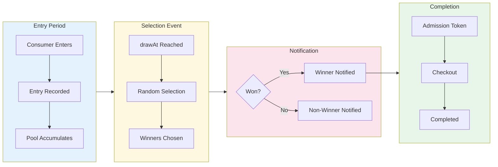

# Draw Distribution (Lottery)

A **Draw** is a lottery-style distribution that randomly selects winners from a pool of entries. Draws are ideal when fairness means "equal chance" rather than "first come, first served."

## Draw Model

```typescript
interface Draw {
  // Base Distribution Fields
  id: string;
  organizationId: string;
  sequenceId: string;
  name: string;
  openAt?: string;
  closeAt?: string;
  timeZone: string;
  supportsGuest: boolean;
  encryptionSeed: string;

  // Draw-Specific Fields
  drawAt: string; // When winners are selected
  capacity?: number; // Max entries allowed
  winnerCount: number; // How many winners to select
  admissionExpirationSeconds?: number; // Winner token validity
  continueSelectingUntilCompleted?: boolean; // Backfill on non-completion

  // Audit
  createdAt: string;
  updatedAt: string;
  archived: boolean;
}
```

## How Draws Work



```
┌────────────────────────────────────────────────────────────────────┐
│                         DRAW LIFECYCLE                              │
├────────────────────────────────────────────────────────────────────┤
│                                                                    │
│  ENTRY PERIOD                 SELECTION              COMPLETION    │
│  ─────────────                ─────────              ──────────    │
│                                                                    │
│  ┌─────────┐                  ┌─────────┐           ┌─────────┐   │
│  │ openAt  │                  │ drawAt  │           │ closeAt │   │
│  └────┬────┘                  └────┬────┘           └────┬────┘   │
│       │                            │                     │        │
│  ─────┼────────────────────────────┼─────────────────────┼────►   │
│       │                            │                     │        │
│       ▼                            ▼                     ▼        │
│  Consumers                    Random                 Winners      │
│  enter draw                   selection              complete     │
│                                    │                              │
│  ┌────────────────┐               │                              │
│  │ ○ ○ ○ ○ ○ ○ ○  │               │                              │
│  │ Pool of        │──── draw ────►│                              │
│  │ entries        │               │                              │
│  └────────────────┘               │                              │
│                                    ▼                              │
│                              ┌─────────────┐                      │
│                              │ ● ● ●       │ Winners selected     │
│                              │ Winners     │                      │
│                              └─────────────┘                      │
│                                    │                              │
│                                    ▼                              │
│                              Notifications                        │
│                              sent to winners                      │
│                                                                    │
└────────────────────────────────────────────────────────────────────┘
```

### Entry Period

1. Draw opens at `openAt` timestamp
2. Consumers enter the draw (one entry per consumer)
3. Entries accumulate until `drawAt`
4. No position or ranking - all entries equal

### Selection Event

1. At `drawAt`, system randomly selects `winnerCount` entries
2. Winners receive admission tokens
3. Non-winners are notified of result
4. Selection is cryptographically verifiable

### Completion Phase

1. Winners have `admissionExpirationSeconds` to complete
2. If `continueSelectingUntilCompleted`, expired winners are replaced
3. Draw closes when all spots filled or `closeAt` reached

## Consumer States

```typescript
const DrawConsumerStatus = {
  NOT_ENTERED: "NOT_ENTERED", // Not in draw
  ENTERED: "ENTERED", // Waiting for selection
  WON: "WON", // Selected as winner
  COMPLETED: "COMPLETED", // Finished checkout
  DENIED: "DENIED", // Not selected (lost)
} as const;
```

### State Machine

```
┌─────────────────────────────────────────────────────────────────┐
│                    DRAW CONSUMER STATES                         │
├─────────────────────────────────────────────────────────────────┤
│                                                                 │
│  ┌─────────────┐                                               │
│  │ NOT_ENTERED │                                               │
│  └──────┬──────┘                                               │
│         │ enter()                                              │
│         ▼                                                      │
│  ┌─────────────┐                                               │
│  │   ENTERED   │                                               │
│  └──────┬──────┘                                               │
│         │                                                      │
│         │ draw event                                           │
│         │                                                      │
│    ┌────┴────┐                                                 │
│    ▼         ▼                                                 │
│ ┌──────┐  ┌────────┐                                          │
│ │ WON  │  │ DENIED │  (not selected)                          │
│ └──┬───┘  └────────┘                                          │
│    │                                                           │
│    │ complete()                                                │
│    ▼                                                           │
│ ┌──────────┐                                                   │
│ │COMPLETED │                                                   │
│ └──────────┘                                                   │
│                                                                 │
│ Note: DENIED = did not win (not negative, just outcome)        │
└─────────────────────────────────────────────────────────────────┘
```

## Draw Consumer Model

```typescript
interface DrawConsumer {
  id: string;
  consumerId: string;
  drawId: string;

  // Status
  status: DrawConsumerStatus;

  // Timestamps
  enteredAt?: string; // When entered draw
  selectedAt?: string; // When selected (if won)
  notifiedAt?: string; // When notified of result
  completedAt?: string; // When completed checkout
  updatedAt?: string;
}
```

## Configuration Options

### Draw Time

When winners are selected:

```typescript
{
  drawAt: "2024-03-01T12:00:00Z"; // Noon UTC on March 1
}

// Must be:
// - After openAt (entry period exists)
// - Before or at closeAt (if set)
```

### Winner Count

How many winners to select:

```typescript
{
  winnerCount: 100; // Select 100 winners
}

// Cannot exceed entry count
// If entries < winnerCount, all entrants win
```

### Entry Capacity

Maximum entries allowed:

```typescript
{
  capacity: 10000; // Max 10,000 entries
}

// null = unlimited entries
{
  capacity: null;
}
```

### Continue Selecting

Backfill when winners don't complete:

```typescript
{
  continueSelectingUntilCompleted: true;
}
```

**Behavior:**

- Winner selected but token expires → new winner drawn from remaining pool
- Continues until `winnerCount` completions or pool exhausted
- Useful for high-value items where completion matters

## Selection Algorithm

The draw uses a cryptographically fair random selection:

```typescript
// Simplified selection logic
function selectWinners(entries: Entry[], count: number, seed: string): Entry[] {
  // Create deterministic random from seed
  const rng = createSeededRandom(seed);

  // Shuffle using Fisher-Yates
  const shuffled = fisherYatesShuffle(entries, rng);

  // Take first N
  return shuffled.slice(0, count);
}
```

### Fairness Guarantees

1. **Equal probability**: Each entry has identical chance of selection
2. **Deterministic**: Same seed + entries = same results (auditable)
3. **Tamper-proof**: Seed is committed before entries close
4. **Verifiable**: Selection can be independently verified

## SDK Usage

### Entering a Draw

```typescript
import { useFanfare } from "@waitify-io/fanfare-sdk-react";

function DrawEntry({ drawId }: { drawId: string }) {
  const { draw } = useFanfare();
  const [entered, setEntered] = useState(false);

  const handleEnter = async () => {
    try {
      await draw.enter(drawId);
      setEntered(true);
    } catch (error) {
      console.error("Entry failed:", error);
    }
  };

  return (
    <div>
      {entered ? (
        <p>Entry confirmed! Winners announced at draw time.</p>
      ) : (
        <button onClick={handleEnter}>Enter Draw</button>
      )}
    </div>
  );
}
```

### Checking Status

```typescript
function DrawStatus({ drawId }: { drawId: string }) {
  const { draw } = useFanfare();
  const [status, setStatus] = useState<DrawConsumerState | null>(null);

  useEffect(() => {
    const checkStatus = async () => {
      const result = await draw.status(drawId);
      setStatus(result);
    };

    checkStatus();

    // Poll for updates around draw time
    const interval = setInterval(checkStatus, 10000);
    return () => clearInterval(interval);
  }, [drawId]);

  if (!status) return <div>Loading...</div>;

  switch (status.status) {
    case "ENTERED":
      return <p>You're entered! Draw happens at {status.drawTime}</p>;

    case "WON":
      return (
        <div>
          <p>Congratulations! You won!</p>
          <a href={`/checkout?token=${status.admissionToken}`}>
            Complete Purchase (expires {status.expiresAt})
          </a>
        </div>
      );

    case "DENIED":
      return <p>You weren't selected this time. Better luck next time!</p>;

    case "COMPLETED":
      return <p>Purchase complete! Thank you.</p>;

    default:
      return null;
  }
}
```

## API Operations

### Create Draw

```bash
POST /v1/sequences/:sequenceId/draws
Authorization: Bearer sk_live_...
Content-Type: application/json

{
  "name": "Limited Edition Draw",
  "openAt": "2024-03-01T00:00:00Z",
  "drawAt": "2024-03-05T12:00:00Z",
  "closeAt": "2024-03-05T23:59:59Z",
  "timeZone": "America/New_York",
  "winnerCount": 100,
  "capacity": 10000,
  "admissionExpirationSeconds": 3600,
  "continueSelectingUntilCompleted": true,
  "supportsGuest": false
}
```

### Get Draw Status

```bash
GET /v1/draws/:id
Authorization: Bearer sk_live_...

# Response (before draw)
{
  "id": "draw-uuid",
  "name": "Limited Edition Draw",
  "status": "open",
  "entryCount": 5432,
  "winnerCount": 100,
  "drawAt": "2024-03-05T12:00:00Z"
}

# Response (after draw)
{
  "id": "draw-uuid",
  "name": "Limited Edition Draw",
  "status": "drawn",
  "entryCount": 8765,
  "winnerCount": 100,
  "selectedCount": 100,
  "completedCount": 87
}
```

### Consumer Enter Draw

```bash
POST /consumers/v1/draws/:drawId/enter
Authorization: Bearer consumer-token

# Response
{
  "status": "ENTERED",
  "enteredAt": "2024-03-02T15:30:00Z",
  "drawAt": "2024-03-05T12:00:00Z"
}
```

### Consumer Get Status

```bash
GET /consumers/v1/draws/:drawId/status
Authorization: Bearer consumer-token

# Response (entered, waiting)
{
  "status": "ENTERED",
  "enteredAt": "2024-03-02T15:30:00Z",
  "drawAt": "2024-03-05T12:00:00Z"
}

# Response (won)
{
  "status": "WON",
  "selectedAt": "2024-03-05T12:00:15Z",
  "admissionToken": "eyJ...",
  "expiresAt": "2024-03-05T13:00:15Z"
}

# Response (not selected)
{
  "status": "DENIED",
  "notifiedAt": "2024-03-05T12:00:15Z"
}
```

## Notifications

### Winner Notifications

Winners receive notifications through configured channels:

```typescript
// Notification sent at draw time
{
  type: "DRAW_WON",
  consumer: { id, email, phone },
  draw: { id, name },
  admissionToken: "...",
  expiresAt: "...",
  checkoutUrl: "..."
}
```

### Non-Winner Notifications

Non-winners can optionally receive notification:

```typescript
// Optional notification
{
  type: "DRAW_NOT_SELECTED",
  consumer: { id, email },
  draw: { id, name },
  // Encourage future participation
  nextDraw: { id, name, openAt }
}
```

## Best Practices

### 1. Allow Adequate Entry Time

Give consumers time to discover and enter:

```typescript
// Good: 3-7 day entry window
{
  openAt: "2024-03-01T00:00:00Z",
  drawAt: "2024-03-07T12:00:00Z"  // Week later
}

// Avoid: Too short
{
  openAt: "2024-03-01T12:00:00Z",
  drawAt: "2024-03-01T14:00:00Z"  // Only 2 hours
}
```

### 2. Set Appropriate Winner Count

Consider completion rates:

```typescript
// If you have 100 items and expect 80% completion
winnerCount: 125  // Select extra to account for non-completion

// Or use continueSelectingUntilCompleted
{
  winnerCount: 100,
  continueSelectingUntilCompleted: true
}
```

### 3. Communicate Draw Time Clearly

Consumers should know exactly when results are announced:

- Show countdown to draw time
- Send reminder before draw
- Notify immediately when drawn

### 4. Require Authentication for Valuable Draws

Prevent duplicate entries:

```typescript
{
  supportsGuest: false; // Must be authenticated
}
```

### 5. Give Winners Reasonable Time

Balance urgency with accessibility:

```typescript
// High-value, limited item
admissionExpirationSeconds: 3600; // 1 hour

// Lower value, more items
admissionExpirationSeconds: 86400; // 24 hours
```

## Common Patterns

### Sneaker Drop Draw

```typescript
{
  name: "Jordan 1 Retro Draw",
  openAt: "2024-03-01T10:00:00Z",
  drawAt: "2024-03-01T11:00:00Z",  // 1 hour entry window
  closeAt: "2024-03-01T23:59:59Z",
  winnerCount: 500,
  admissionExpirationSeconds: 900,  // 15 minutes
  continueSelectingUntilCompleted: true,
  supportsGuest: false
}
```

### Presale Draw

```typescript
{
  name: "Concert Presale Draw",
  openAt: "2024-02-15T00:00:00Z",
  drawAt: "2024-02-28T12:00:00Z",  // 2 week entry
  closeAt: "2024-03-01T23:59:59Z",
  winnerCount: 1000,
  admissionExpirationSeconds: 86400,  // 24 hours
  supportsGuest: false
}
```

### Tiered Draw (Multiple Sequences)

```typescript
// VIP sequence - better odds
{
  name: "VIP Draw",
  sequenceId: "vip-sequence",
  winnerCount: 50,  // 50 of 200 VIPs = 25% odds
  audienceId: "vip-audience"
}

// General sequence
{
  name: "General Draw",
  sequenceId: "general-sequence",
  winnerCount: 200  // 200 of 10000 = 2% odds
}
```

## Related Concepts

- [Distributions Overview](/docs/concepts/distributions/overview) - Common distribution concepts
- [Queue Distribution](/docs/concepts/distributions/queue) - First-come alternative
- [Audiences](/docs/concepts/audiences) - Tiered access for draws
