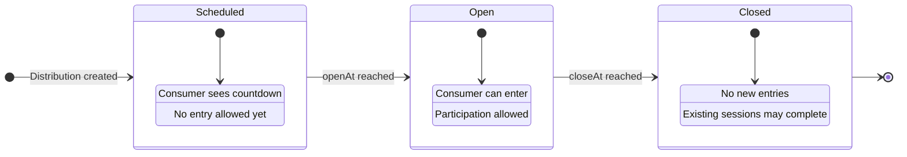

# Distributions Overview

A **Distribution** is the mechanism that controls how consumers gain access to purchase products within an experience. Different distribution types suit different business scenarios, from high-demand product launches to exclusive VIP events.

## Distribution Types

Fanfare supports six distribution types:

| Type                                                    | Description                      | Best For                               |
| ------------------------------------------------------- | -------------------------------- | -------------------------------------- |
| [Queue](/docs/concepts/distributions/queue)             | FIFO waiting line                | High-demand launches with steady flow  |
| [Draw](/docs/concepts/distributions/lottery)            | Random lottery selection         | Fair allocation with limited inventory |
| [Auction](/docs/concepts/distributions/auction)         | Competitive bidding              | Price discovery for limited items      |
| [Appointment](/docs/concepts/distributions/appointment) | Time-slot booking                | In-store pickups, consultations        |
| [Timed Release](/docs/concepts/distributions/instant)   | Instant access at scheduled time | Flash sales, membership perks          |
| [Waitlist](/docs/concepts/distributions/exclusive)      | Interest capture                 | Pre-launch signup, overflow handling   |

## Common Fields

All distribution types share these base fields:

```typescript
interface BaseDistribution {
  // Identity
  id: string; // UUID
  organizationId: string; // Parent organization
  sequenceId: string; // Parent sequence

  // Display
  name: string; // Distribution name

  // Timing
  openAt?: string; // When distribution opens
  closeAt?: string; // When distribution closes
  timeZone: string; // Timezone for display

  // Access Control
  supportsGuest: boolean; // Allow anonymous consumers

  // Security
  encryptionSeed: string; // For admission token encryption

  // Audit
  createdAt: string;
  updatedAt: string;
  archived: boolean;
}
```

## Distribution Lifecycle

Distributions progress through states based on timing:



```
┌────────────────────────────────────────────────────────────────────┐
│                    DISTRIBUTION LIFECYCLE                          │
├────────────────────────────────────────────────────────────────────┤
│                                                                    │
│  ┌──────────┐        ┌──────────┐        ┌──────────┐            │
│  │SCHEDULED │──time──►│  OPEN    │──time──►│ CLOSED   │            │
│  │          │        │          │        │          │            │
│  │ Consumer │        │ Consumer │        │ No new   │            │
│  │ sees     │        │ can      │        │ entries  │            │
│  │ countdown│        │ enter    │        │          │            │
│  └──────────┘        └──────────┘        └──────────┘            │
│                                                                    │
│       openAt                 closeAt                               │
│         │                      │                                   │
│  ───────┼──────────────────────┼──────────────────►  time         │
│                                                                    │
└────────────────────────────────────────────────────────────────────┘
```

### State Determination

```typescript
function getDistributionState(distribution: BaseDistribution): "scheduled" | "open" | "closed" {
  const now = new Date();
  const openAt = distribution.openAt ? new Date(distribution.openAt) : null;
  const closeAt = distribution.closeAt ? new Date(distribution.closeAt) : null;

  if (openAt && now < openAt) return "scheduled";
  if (closeAt && now > closeAt) return "closed";
  return "open";
}
```

## Consumer Participation States

Each distribution type has its own consumer state model. However, they share common patterns:

### Entry States

- **Not Entered**: Consumer has not joined the distribution
- **Entered/Participating**: Consumer is actively participating

### Outcome States

- **Admitted/Won**: Consumer received access
- **Denied/Lost**: Consumer did not receive access
- **Completed**: Consumer finished their session
- **Expired**: Consumer's access window expired
- **Left**: Consumer voluntarily left

### State Transition Pattern

```
              ┌─────────────────────────────────────────────┐
              │                                             │
              │  ┌─────────┐                                │
              │  │  NOT    │                                │
              │  │ ENTERED │                                │
              │  └────┬────┘                                │
              │       │ enter()                             │
              │       ▼                                     │
              │  ┌─────────────┐                            │
              │  │PARTICIPATING│◄──────────────┐            │
              │  └──────┬──────┘               │            │
              │         │                      │            │
              │    ┌────┴────┐           leave()           │
              │    ▼         ▼                 │            │
              │ ┌──────┐  ┌──────┐         ┌──────┐        │
              │ │ADMIT │  │DENIED│         │ LEFT │        │
              │ └──┬───┘  └──────┘         └──────┘        │
              │    │                                       │
              │    │ complete()                            │
              │    ▼                                       │
              │ ┌──────────┐                               │
              │ │COMPLETED │                               │
              │ └──────────┘                               │
              │                                             │
              └─────────────────────────────────────────────┘
```

## Admission Tokens

When a consumer successfully gains access through a distribution, they receive an **admission token**. This token authorizes them to complete their purchase.

### Token Structure

```typescript
interface AdmissionToken {
  token: string; // Encrypted token value
  distributionType: string; // "queue", "draw", etc.
  distributionId: string; // Source distribution
  consumerId: string; // Token holder
  experienceId: string; // Parent experience
  sequenceId: string; // Parent sequence
  admittedAt: string; // When admission was granted
  expiresAt?: string; // When token expires
}
```

### Token Lifecycle

```
┌─────────────────────────────────────────────────────────────┐
│                    TOKEN LIFECYCLE                          │
├─────────────────────────────────────────────────────────────┤
│                                                             │
│   Consumer gains access                                     │
│          │                                                  │
│          ▼                                                  │
│   ┌─────────────┐                                          │
│   │TOKEN ISSUED │  Token created with expiration           │
│   └──────┬──────┘                                          │
│          │                                                  │
│    ┌─────┴─────┐                                           │
│    ▼           ▼                                           │
│ ┌──────┐   ┌──────┐                                        │
│ │USED  │   │EXPIRED│                                       │
│ └──┬───┘   └───────┘                                       │
│    │                                                        │
│    ▼                                                        │
│ ┌──────────┐                                               │
│ │COMPLETED │  Purchase completed                           │
│ └──────────┘                                               │
│                                                             │
└─────────────────────────────────────────────────────────────┘
```

### Token Validation

Tokens are validated against:

1. **Signature**: Token hasn't been tampered with
2. **Expiration**: Token hasn't expired
3. **Consumer**: Token belongs to the requesting consumer
4. **Usage**: Token hasn't already been used
5. **Distribution**: Source distribution is still valid

## Distribution Hierarchy

Distributions exist within sequences, which exist within experiences:

```
Experience
└── Sequence (audience-targeted)
    ├── Queue (one or more)
    ├── Draw (one or more)
    ├── Auction (one or more)
    ├── Appointment (one or more)
    ├── TimedRelease (one or more)
    └── Waitlist (at most one)
```

### Multiple Distributions per Sequence

A sequence can have multiple distributions of the same type running in parallel or sequentially:

```typescript
// Sequential: Different time windows
{
  sequences: [
    {
      name: "General Access",
      queues: [
        { name: "Morning Queue", openAt: "09:00", closeAt: "12:00" },
        { name: "Afternoon Queue", openAt: "14:00", closeAt: "17:00" },
      ],
    },
  ];
}

// Parallel: Different capacity/products
{
  sequences: [
    {
      name: "Product Selection",
      queues: [
        { name: "Product A Queue", maxAdmissions: 100 },
        { name: "Product B Queue", maxAdmissions: 50 },
      ],
    },
  ];
}
```

## Guest vs Authenticated Access

The `supportsGuest` field controls whether anonymous consumers can participate:

| Value   | Behavior                       |
| ------- | ------------------------------ |
| `true`  | Anonymous consumers can enter  |
| `false` | Consumer must be authenticated |

### Use Cases by Type

| Distribution  | Typical Setting | Reasoning              |
| ------------- | --------------- | ---------------------- |
| Queue         | `true`          | Low friction entry     |
| Draw          | `true`          | Maximize entries       |
| Auction       | `false`         | Payment required       |
| Appointment   | `false`         | Booking accountability |
| Timed Release | `true`          | Quick access           |
| Waitlist      | `true`          | Lead capture           |

## Capacity Management

Distributions manage capacity through different mechanisms:

### Queue Capacity

```typescript
interface Queue extends BaseDistribution {
  capacity?: number; // Max consumers in queue
  admitRate: number; // Admissions per minute
  maxAdmissions?: number; // Total admissions limit
  admissionExpirationSeconds?: number; // Token validity
}
```

### Draw Capacity

```typescript
interface Draw extends BaseDistribution {
  capacity?: number; // Max entries
  winnerCount: number; // How many to select
  admissionExpirationSeconds?: number;
  continueSelectingUntilCompleted?: boolean;
}
```

### Auction Capacity

```typescript
// Auctions typically have single-item capacity
// Winner count is implicit (highest bidder wins)
```

## Real-Time Updates

Active distributions maintain real-time state in Valkey for sub-second updates:

- **Queue positions**: Where each consumer is in line
- **Estimated wait times**: How long until admission
- **Auction bids**: Current bid amounts
- **Draw entries**: Entry counts and timing

See [Real-Time Updates](/docs/concepts/real-time) for implementation details.

## Choosing the Right Distribution

| Scenario                   | Recommended   | Why                             |
| -------------------------- | ------------- | ------------------------------- |
| High-demand product launch | Queue         | Predictable flow, fair ordering |
| Limited sneaker drop       | Draw          | Fair random selection           |
| Collectible/art sale       | Auction       | Price discovery                 |
| Store appointment          | Appointment   | Scheduled interaction           |
| Flash sale                 | Timed Release | Instant access at time          |
| Product interest capture   | Waitlist      | Notify when available           |

### Decision Flow

```
Is there more demand than supply?
    │
    ├── Yes
    │   │
    │   └── Is ordering important?
    │       │
    │       ├── Yes (first-come fairness) ──► Queue
    │       │
    │       └── No (random fairness) ──► Draw
    │
    └── No
        │
        └── Is timing important?
            │
            ├── Yes (scheduled access) ──► Appointment
            │
            └── No (instant access) ──► Timed Release
```

## API Common Operations

### Get Distribution Status

```bash
# Queue example
GET /v1/queues/:id
Authorization: Bearer sk_live_...

# Response includes state
{
  "id": "queue-uuid",
  "name": "Main Queue",
  "openAt": "2024-03-01T09:00:00Z",
  "closeAt": "2024-03-01T17:00:00Z",
  "status": "open",
  "currentSize": 150,
  "estimatedWaitTime": 1200
}
```

### Check Consumer Status

```bash
# Get consumer's status in distribution
GET /v1/queues/:queueId/consumers/:consumerId
Authorization: Bearer sk_live_...

{
  "status": "QUEUED",
  "position": 45,
  "estimatedWaitTimeInSeconds": 600
}
```

## Next Steps

Learn about each distribution type in detail:

- [Queue Distribution](/docs/concepts/distributions/queue) - FIFO waiting lines
- [Draw Distribution](/docs/concepts/distributions/lottery) - Random selection
- [Auction Distribution](/docs/concepts/distributions/auction) - Competitive bidding
- [Appointment Distribution](/docs/concepts/distributions/appointment) - Time-slot booking
- [Timed Release Distribution](/docs/concepts/distributions/instant) - Instant access
- [Waitlist Distribution](/docs/concepts/distributions/exclusive) - Interest capture
