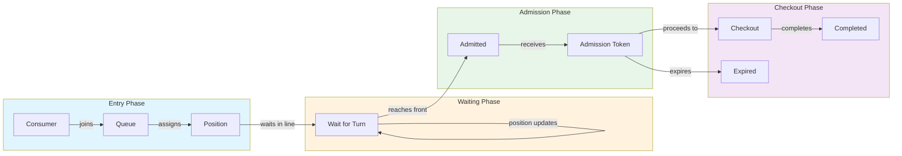

# Queue Distribution

A **Queue** is a first-in-first-out (FIFO) distribution mechanism that manages high demand by admitting consumers in the order they joined. Queues are ideal for product launches where fairness means "first come, first served."

## Queue Model

```typescript
interface Queue {
  // Base Distribution Fields
  id: string;
  organizationId: string;
  sequenceId: string;
  name: string;
  openAt?: string;
  closeAt?: string;
  timeZone: string;
  supportsGuest: boolean;
  encryptionSeed: string;

  // Queue-Specific Fields
  capacity?: number; // Max consumers allowed in queue
  admitRate: number; // Admissions per minute
  maxAdmissions?: number; // Total admissions limit
  admissionExpirationSeconds?: number; // How long admission tokens last

  // Audit
  createdAt: string;
  updatedAt: string;
  archived: boolean;
}
```

## How Queues Work



```
┌────────────────────────────────────────────────────────────────────┐
│                         QUEUE FLOW                                  │
├────────────────────────────────────────────────────────────────────┤
│                                                                    │
│    Consumers join queue                                            │
│           │                                                        │
│           ▼                                                        │
│    ┌──────────────────────────────────────────┐                   │
│    │ ○ ○ ○ ○ ○ ○ ○ ○ ○ ○ ○ ○ ○ │ ● │           │                   │
│    │ Back of queue          │ │ Front │      →  Admitted           │
│    └──────────────────────────────────────────┘                   │
│           │                        │                               │
│           │                        │                               │
│           │                   admitRate                            │
│           │              consumers/minute                          │
│           │                        │                               │
│           ▼                        ▼                               │
│    New entries              Admission tokens                       │
│                                    │                               │
│                                    ▼                               │
│                              Checkout flow                         │
│                                                                    │
└────────────────────────────────────────────────────────────────────┘
```

### Entry Flow

1. Consumer enters the experience and is routed to a sequence
2. Consumer requests to join the queue
3. System validates:
   - Queue is open (within `openAt`/`closeAt`)
   - Queue has capacity (if `capacity` is set)
   - Consumer is eligible (audience, access code)
   - Consumer hasn't exceeded order limits
4. Consumer is assigned a position
5. Consumer receives real-time position updates

### Admission Flow

1. System admits consumers at the configured `admitRate`
2. Consumer at front of queue receives admission token
3. Token includes expiration time (`admissionExpirationSeconds`)
4. Consumer has limited time to complete checkout
5. If token expires, consumer loses their spot

## Consumer States

```typescript
const QueueConsumerStatus = {
  NOT_QUEUED: "NOT_QUEUED", // Not in queue
  QUEUED: "QUEUED", // Waiting in line
  ADMITTED: "ADMITTED", // Has active admission
  COMPLETED: "COMPLETED", // Finished checkout
  DENIED: "DENIED", // Entry was denied
  LEFT: "LEFT", // Voluntarily left
} as const;
```

### State Machine

```
┌─────────────────────────────────────────────────────────────────┐
│                    QUEUE CONSUMER STATES                        │
├─────────────────────────────────────────────────────────────────┤
│                                                                 │
│  ┌────────────┐                                                │
│  │ NOT_QUEUED │──── entry denied ────►┌────────┐              │
│  └─────┬──────┘                       │ DENIED │              │
│        │                              └────────┘              │
│        │ join()                                               │
│        ▼                                                      │
│  ┌──────────┐                                                 │
│  │  QUEUED  │◄───────────────────────────────┐               │
│  └────┬─────┘                                │               │
│       │                                      │               │
│  ┌────┴────┐                                 │               │
│  │         │                            leave()              │
│  │    ┌────┴────┐                            │               │
│  │    ▼         ▼                            │               │
│  │ admit()   leave()                         │               │
│  │    │         │                            │               │
│  │    ▼         ▼                            │               │
│  │ ┌────────┐  ┌──────┐                     │               │
│  │ │ADMITTED│  │ LEFT │                     │               │
│  │ └───┬────┘  └──────┘                     │               │
│  │     │                                     │               │
│  │     │ complete()                          │               │
│  │     │                or                   │               │
│  │     │ expire ──────────────────►┌──────────┐             │
│  │     │                           │ EXPIRED* │             │
│  │     ▼                           └──────────┘             │
│  │ ┌──────────┐                                             │
│  │ │COMPLETED │                                             │
│  │ └──────────┘                                             │
│  │                                                          │
│  └──────────────────────────────────────────────────────────┘
│                                                                 │
│  * EXPIRED typically maps to re-queueable or denied             │
└─────────────────────────────────────────────────────────────────┘
```

## Queue Consumer Model

```typescript
interface QueueConsumer {
  id: string;
  consumerId: string;
  queueId: string;
  sequenceId: string;

  // Status
  status: QueueConsumerStatus;
  reason?: string; // Reason if denied

  // Timestamps
  enqueuedAt?: string; // When joined queue
  dequeuedAt?: string; // When left front of queue
  completedAt?: string; // When completed checkout
  updatedAt?: string;
}
```

## Configuration Options

### Capacity

Maximum number of consumers allowed in the queue at once:

```typescript
{
  capacity: 10000; // Max 10,000 in queue
}

// null = unlimited capacity
{
  capacity: null;
}
```

### Admit Rate

How many consumers per minute receive admission:

```typescript
{
  admitRate: 100; // 100 consumers per minute admitted
}

// This translates to:
// - ~1.67 consumers per second
// - One admission every 600ms
```

**Tuning admit rate:**

- Too high: Checkout system overwhelmed
- Too low: Unnecessary waiting, consumer frustration
- Optimal: Match your checkout capacity

### Max Admissions

Total number of admissions before queue stops admitting:

```typescript
{
  maxAdmissions: 500; // Stop after 500 admitted
}

// null = no limit (runs until closeAt)
{
  maxAdmissions: null;
}
```

**Use cases:**

- Limited inventory (only 500 items)
- Capacity events (500 seats)
- Flash sales (first 500 get discount)

### Admission Expiration

How long admitted consumers have to complete checkout:

```typescript
{
  admissionExpirationSeconds: 600; // 10 minute window
}

// null = no expiration (not recommended)
{
  admissionExpirationSeconds: null;
}
```

**Best practices:**

- 5-10 minutes for simple checkouts
- 15-30 minutes for complex purchases
- Always set expiration to prevent token hoarding

## Position and Wait Time

### Position Calculation

Position is calculated from entry order:

```typescript
// Position 1 = next to be admitted
// Position N = N-1 consumers ahead

interface QueuedConsumerState {
  status: "QUEUED";
  position: number; // Current position
  estimatedWaitTimeInSeconds: number;
}
```

### Wait Time Estimation

Estimated wait time is calculated from position and admit rate:

```typescript
// Simple estimation
estimatedWaitSeconds = (position / admitRate) * 60;

// Example: Position 150, admitRate 100/min
// Wait = (150 / 100) * 60 = 90 seconds
```

**Note:** Actual wait times vary based on:

- Consumers who leave
- Admission token expirations (spot recycling)
- Rate adjustments

## Deny Reasons

Entry can be denied for several reasons:

```typescript
const QueueDenyReason = {
  ORDER_LIMIT_EXCEEDED: "ORDER_LIMIT_EXCEEDED",
  CAPACITY_EXCEEDED: "CAPACITY_EXCEEDED",
  VALIDATION_FAILED: "VALIDATION_FAILED",
  AUDIENCE_MISMATCH: "AUDIENCE_MISMATCH",
  QUEUE_CLOSED: "QUEUE_CLOSED",
  ADMISSION_EXPIRED: "ADMISSION_EXPIRED",
} as const;
```

| Reason                 | Description                   | Consumer Action         |
| ---------------------- | ----------------------------- | ----------------------- |
| `ORDER_LIMIT_EXCEEDED` | Already purchased max allowed | None (fair enforcement) |
| `CAPACITY_EXCEEDED`    | Queue is full                 | Try again later         |
| `VALIDATION_FAILED`    | Invalid request               | Fix and retry           |
| `AUDIENCE_MISMATCH`    | Not in required audience      | Contact support         |
| `QUEUE_CLOSED`         | Outside open hours            | Wait for reopening      |
| `ADMISSION_EXPIRED`    | Took too long                 | Re-queue if allowed     |

## SDK Usage

### Entering a Queue

```typescript
import { useFanfare } from "@waitify-io/fanfare-sdk-react";

function QueueComponent({ queueId }: { queueId: string }) {
  const { queue } = useFanfare();

  const handleJoin = async () => {
    try {
      const result = await queue.enter(queueId);
      console.log("Position:", result.position);
      console.log("Est. wait:", result.estimatedWaitTimeInSeconds);
    } catch (error) {
      if (error.code === "ORDER_LIMIT_EXCEEDED") {
        // Handle limit
      }
    }
  };

  return <button onClick={handleJoin}>Join Queue</button>;
}
```

### Monitoring Position

```typescript
function QueueStatus({ queueId }: { queueId: string }) {
  const { queue } = useFanfare();
  const [status, setStatus] = useState<QueueConsumerState | null>(null);

  useEffect(() => {
    // Start polling for updates
    queue.startPolling(queueId, 5000); // Every 5 seconds

    // Subscribe to status changes
    const unsubscribe = queue.onStatusChange(queueId, setStatus);

    return () => {
      queue.stopPolling(queueId);
      unsubscribe();
    };
  }, [queueId]);

  if (!status) return <div>Loading...</div>;

  if (status.status === "QUEUED") {
    return (
      <div>
        <p>Position: {status.position}</p>
        <p>Est. wait: {Math.round(status.estimatedWaitTimeInSeconds / 60)} min</p>
      </div>
    );
  }

  if (status.status === "ADMITTED") {
    return (
      <div>
        <p>You're in! Complete checkout before your time expires.</p>
        <a href={`/checkout?token=${status.admissionToken}`}>
          Complete Purchase
        </a>
      </div>
    );
  }

  return null;
}
```

## API Operations

### Create Queue

```bash
POST /v1/sequences/:sequenceId/queues
Authorization: Bearer sk_live_...
Content-Type: application/json

{
  "name": "Main Queue",
  "openAt": "2024-03-01T09:00:00Z",
  "closeAt": "2024-03-01T17:00:00Z",
  "timeZone": "America/New_York",
  "admitRate": 100,
  "maxAdmissions": 500,
  "admissionExpirationSeconds": 600,
  "supportsGuest": true
}
```

### Get Queue Status

```bash
GET /v1/queues/:id
Authorization: Bearer sk_live_...

# Response
{
  "id": "queue-uuid",
  "name": "Main Queue",
  "status": "open",
  "currentSize": 1250,
  "totalAdmitted": 350,
  "maxAdmissions": 500,
  "estimatedWaitTime": 750
}
```

### Consumer Join Queue

```bash
POST /consumers/v1/queues/:queueId/enter
Authorization: Bearer consumer-token
Content-Type: application/json

{
  "metadata": {
    "selectedVariant": "variant-uuid"
  }
}

# Response
{
  "position": 1251,
  "estimatedWaitTimeInSeconds": 751,
  "status": "QUEUED"
}
```

### Consumer Get Status

```bash
GET /consumers/v1/queues/:queueId/status
Authorization: Bearer consumer-token

# Response (queued)
{
  "status": "QUEUED",
  "position": 845,
  "estimatedWaitTimeInSeconds": 507
}

# Response (admitted)
{
  "status": "ADMITTED",
  "admissionToken": "eyJ...",
  "expiresAt": "2024-03-01T10:15:00Z"
}
```

## Best Practices

### 1. Set Realistic Admit Rates

Match your checkout capacity:

```typescript
// If checkout handles 2 purchases/second
// Set admitRate to account for:
// - Not everyone will complete
// - Allow buffer for peaks
admitRate: 100; // ~1.67/sec leaves headroom
```

### 2. Configure Appropriate Expiration

Balance urgency with completion time:

```typescript
// Simple checkout (single item, saved payment)
admissionExpirationSeconds: 300; // 5 minutes

// Complex checkout (multiple items, new payment)
admissionExpirationSeconds: 900; // 15 minutes
```

### 3. Monitor and Adjust

Track these metrics:

- **Queue length over time**: Spot capacity issues
- **Completion rate**: Are tokens expiring too often?
- **Average wait time**: Consumer experience quality

### 4. Communicate Clearly

Show consumers:

- Their position in line
- Estimated wait time
- What happens when admitted
- Time remaining to complete (when admitted)

### 5. Handle Capacity Thoughtfully

When queue is full:

- Show clear message about capacity
- Offer waitlist alternative
- Provide estimated reopening time

## Common Patterns

### Rolling Queue

Queue that continuously accepts and admits:

```typescript
{
  openAt: "2024-03-01T00:00:00Z",
  closeAt: "2024-03-31T23:59:59Z",  // Month-long
  admitRate: 50,
  maxAdmissions: null,  // No limit
  capacity: 5000  // But limit active queue size
}
```

### Burst Queue

Handle launch spikes:

```typescript
{
  openAt: "2024-03-01T09:00:00Z",
  closeAt: "2024-03-01T09:30:00Z",  // 30-minute window
  admitRate: 200,  // High rate
  maxAdmissions: 1000,
  capacity: null  // Accept everyone
}
```

### Recycling Queue

Re-queue expired admissions:

```typescript
// Enable in configuration
{
  admissionExpirationSeconds: 600,
  recycleExpiredSpots: true  // Expired = back in queue at original position
}
```

## Related Concepts

- [Distributions Overview](/docs/concepts/distributions/overview) - Common distribution concepts
- [Draw Distribution](/docs/concepts/distributions/lottery) - Alternative fair allocation
- [Real-Time Updates](/docs/concepts/real-time) - Position update implementation
