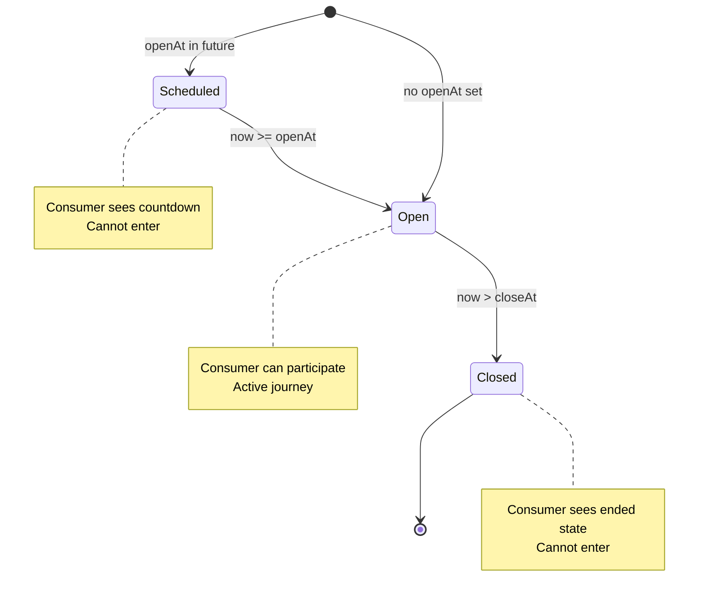

# Experiences

An **Experience** is the central container for a product launch, sale event, or access-controlled offering in Fanfare. It groups together products, sequences, distributions, and timing to orchestrate how consumers access your offerings.

## Experience Model

```typescript
interface Experience {
  // Identity
  id: string; // UUID
  organizationId: string; // Parent organization
  name: string; // Display name

  // Timing
  openAt?: string; // ISO timestamp when experience opens
  closeAt?: string; // ISO timestamp when experience closes
  timeZone: string; // Timezone for display (e.g., "America/New_York")

  // Access Control
  accessCode?: string; // Optional code required to enter

  // Products
  products?: ExperienceProduct[]; // Associated products
  product?: Product; // Primary product (convenience field)

  // Customization
  theme?: ExperienceTheme; // Visual customization
  i18n?: Record<string, Record<string, string>>; // Localization overrides

  // Relations
  sequences?: Sequence[]; // Access paths within this experience

  // Audit
  createdAt: string;
  updatedAt: string;
  archived: boolean;
}
```

## Experience Lifecycle

Experiences exist in different states based on their timing configuration:



```
            ┌─────────────────────────────────────────────────────────┐
Timeline    │  Before openAt  │  openAt → closeAt  │  After closeAt  │
            └─────────────────────────────────────────────────────────┘
                    ▼                   ▼                   ▼
State          SCHEDULED             OPEN               CLOSED
                    │                   │                   │
Consumer       Cannot enter      Can participate     Cannot enter
Access         (sees countdown)  (active journey)    (sees ended state)
```

### State Determination

The experience state is determined dynamically based on current time:

```typescript
function getExperienceState(experience: Experience): "scheduled" | "open" | "closed" {
  const now = new Date();
  const openAt = experience.openAt ? new Date(experience.openAt) : null;
  const closeAt = experience.closeAt ? new Date(experience.closeAt) : null;

  if (openAt && now < openAt) return "scheduled";
  if (closeAt && now > closeAt) return "closed";
  return "open";
}
```

### Timing Configurations

| openAt | closeAt | Behavior                                      |
| ------ | ------- | --------------------------------------------- |
| Set    | Set     | Opens at `openAt`, closes at `closeAt`        |
| Set    | null    | Opens at `openAt`, never closes automatically |
| null   | Set     | Open immediately, closes at `closeAt`         |
| null   | null    | Always open (manual control only)             |

## Sequences

Sequences define the different paths consumers can take within an experience. They enable tiered access and targeted distribution strategies.

### Sequence Model

```typescript
interface Sequence {
  id: string;
  organizationId: string;
  experienceId: string;
  name: string; // Display name (e.g., "VIP Access")
  priority: number; // Evaluation order (higher = checked first)
  color: string; // UI identifier color
  audienceId?: string; // Required audience membership
  accessCode?: string; // Required access code
  productSelectionMode?: "USER_SELECTED" | "SYSTEM_ASSIGNED";
}
```

### Sequence Routing

When a consumer enters an experience, they are routed to a sequence:

```
Consumer enters experience
         │
         ▼
┌─────────────────────────────┐
│ Get sequences ordered by    │
│ priority (descending)       │
└─────────────────────────────┘
         │
         ▼
┌─────────────────────────────┐
│ For each sequence:          │◄──────┐
│ 1. Check audience membership│       │
│ 2. Check access code        │       │
│ 3. Check access rules       │       │
└─────────────────────────────┘       │
         │                            │
    ┌────┴────┐                       │
    ▼         ▼                       │
 Access    Access                     │
 Granted   Denied ────────────────────┘
    │
    ▼
┌─────────────────────────────┐
│ Assign consumer to sequence │
│ Enter active distribution   │
└─────────────────────────────┘
```

### Sequence Priority

Sequences are evaluated in priority order (highest first):

```typescript
// Example: Three sequences with different priorities
[
  { name: "VIP", priority: 100, audienceId: "vip-audience" },
  { name: "Early Access", priority: 50, accessCode: "EARLYBIRD" },
  { name: "General", priority: 0, audienceId: null, accessCode: null },
];

// Routing behavior:
// 1. Check if consumer is in VIP audience → assign to VIP
// 2. Else check if consumer has EARLYBIRD code → assign to Early Access
// 3. Else assign to General
```

### Product Selection Mode

Sequences can control how products are assigned:

| Mode              | Behavior                                               |
| ----------------- | ------------------------------------------------------ |
| `USER_SELECTED`   | Consumer chooses their product (default)               |
| `SYSTEM_ASSIGNED` | System randomly assigns based on weights (mystery box) |

## Experience Products

Products are associated with experiences through a junction table that supports ordering and primary selection:

```typescript
interface ExperienceProduct {
  id: string;
  experienceId: string;
  productId: string;
  productVariantId?: string; // Optional specific variant
  isPrimary: boolean; // Is this the primary product?
  position: number; // Display order
  product?: Product; // Populated product details
}
```

### Single vs. Multi-Product Experiences

**Single Product**: Most experiences have one primary product

```typescript
{
  name: "iPhone 16 Launch",
  products: [
    { productId: "iphone-16", isPrimary: true, position: 0 }
  ]
}
```

**Multi-Product**: Experiences can offer multiple products

```typescript
{
  name: "Summer Collection Drop",
  products: [
    { productId: "sneaker-a", isPrimary: true, position: 0 },
    { productId: "sneaker-b", isPrimary: false, position: 1 },
    { productId: "sneaker-c", isPrimary: false, position: 2 }
  ]
}
```

## Theming

Experiences support visual customization through the theme object:

```typescript
interface ExperienceTheme {
  // Colors
  primaryColor?: string; // Primary brand color
  backgroundColor?: string; // Background color
  textColor?: string; // Primary text color
  accentColor?: string; // Accent/highlight color

  // Branding
  logoUrl?: string; // Logo image URL
  backgroundImageUrl?: string; // Background image
  faviconUrl?: string; // Favicon

  // Typography
  fontFamily?: string; // Custom font family

  // Layout
  containerStyle?: "card" | "full"; // Widget container style
  borderRadius?: number; // Corner rounding
}
```

### Theme Inheritance

Themes cascade from organization to experience:

```
Organization Theme (defaults)
         │
         ▼
Experience Theme (overrides)
         │
         ▼
Widget Rendering
```

## Localization (i18n)

Experiences support per-language string overrides:

```typescript
{
  i18n: {
    "en": {
      "queue.title": "You're in line!",
      "queue.position": "Position: {{position}}"
    },
    "es": {
      "queue.title": "¡Estás en la fila!",
      "queue.position": "Posición: {{position}}"
    }
  }
}
```

## Creating Experiences

### Basic Experience

```typescript
const experience = await api.experiences.create({
  name: "Product Launch",
  timeZone: "America/New_York",
  openAt: "2024-03-01T09:00:00-05:00",
  closeAt: "2024-03-01T21:00:00-05:00",
  products: [{ productId: "product-uuid", isPrimary: true }],
});
```

### Experience with Sequence

```typescript
const experience = await api.experiences.create({
  name: "VIP Product Launch",
  timeZone: "America/New_York",
  openAt: "2024-03-01T09:00:00-05:00",
  products: [{ productId: "product-uuid", isPrimary: true }],
  sequence: {
    name: "General Access",
    queues: [
      {
        name: "Main Queue",
        admitRate: 100, // consumers per minute
        admissionExpirationSeconds: 600, // 10 minute window
      },
    ],
  },
});
```

## Consumer Journey

When a consumer participates in an experience, they progress through stages:

```typescript
type JourneyStage =
  | "not_started" // Consumer has not entered
  | "entering" // Entry in progress
  | "needs_auth" // Authentication required
  | "needs_access_code" // Access code required
  | "routing" // Finding appropriate sequence
  | "routed"; // Assigned to sequence

type SequenceStage =
  | "none" // No active participation
  | "upcoming" // Distribution not yet open
  | "waitlist_entered" // On waitlist for upcoming
  | "active_enterable" // Can enter active distribution
  | "participating" // In queue/draw/auction
  | "admitted" // Has admission token
  | "admission_expired" // Admission expired
  | "ended"; // Distribution ended
```

[Learn more about the Consumer Journey](/docs/sdk/consumer-journey)

## Best Practices

### 1. Plan Your Timing

- Set `openAt` to when you want consumers to start participating
- Set `closeAt` based on your operational capacity
- Use the experience timezone to ensure correct display

### 2. Design Sequences Thoughtfully

- Use priority to control routing order
- Higher priority sequences should have stricter requirements
- Always have a fallback sequence for general access

### 3. Configure Products Early

- Associate products before the experience opens
- Test product display in preview mode
- Ensure inventory is synced if tracked externally

### 4. Test the Consumer Journey

- Use test mode to simulate consumer flows
- Verify sequence routing logic
- Test admission token redemption

## API Reference

### Create Experience

```bash
POST /v1/experiences
Authorization: Bearer sk_live_...
Content-Type: application/json

{
  "name": "Summer Sale",
  "timeZone": "America/New_York",
  "openAt": "2024-06-01T00:00:00-04:00",
  "closeAt": "2024-06-30T23:59:59-04:00"
}
```

### Get Experience

```bash
GET /v1/experiences/:id
Authorization: Bearer sk_live_...

# With related data
GET /v1/experiences/:id?include=sequences,distributions
```

### Update Experience

```bash
PATCH /v1/experiences/:id
Authorization: Bearer sk_live_...
Content-Type: application/json

{
  "name": "Updated Name",
  "closeAt": "2024-06-15T23:59:59-04:00"
}
```

## Next Steps

- [Distributions](/docs/concepts/distributions/overview) - How consumers gain access
- [Audiences](/docs/concepts/audiences) - Targeting specific consumer groups
- [Products](/docs/concepts/products) - Product catalog management
