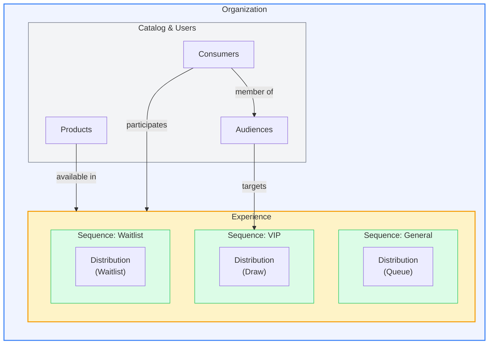
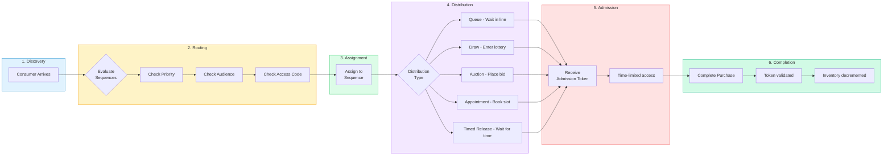

# Platform Overview

Fanfare is a SaaS platform for managing controlled product access through virtual waiting rooms, queues, auctions, draws, and appointments. This document provides a conceptual map of the platform's core entities and how they relate to each other.

## Architecture at a Glance



```
┌─────────────────────────────────────────────────────────────────────┐
│                          ORGANIZATION                               │
│  (Multi-tenant container for all business data)                     │
├─────────────────────────────────────────────────────────────────────┤
│                                                                     │
│  ┌──────────────┐    ┌──────────────┐    ┌──────────────┐          │
│  │   PRODUCTS   │    │   AUDIENCES  │    │  CONSUMERS   │          │
│  │  (Catalog)   │◄───│   (Groups)   │◄───│   (Users)    │          │
│  └──────────────┘    └──────────────┘    └──────────────┘          │
│         │                   │                   │                   │
│         ▼                   ▼                   ▼                   │
│  ┌─────────────────────────────────────────────────────────────┐   │
│  │                       EXPERIENCE                             │   │
│  │  (Container for a product launch or event)                   │   │
│  ├─────────────────────────────────────────────────────────────┤   │
│  │  ┌─────────────┐  ┌─────────────┐  ┌─────────────┐          │   │
│  │  │  SEQUENCE   │  │  SEQUENCE   │  │  SEQUENCE   │          │   │
│  │  │   (VIP)     │  │  (General)  │  │  (Waitlist) │          │   │
│  │  ├─────────────┤  ├─────────────┤  ├─────────────┤          │   │
│  │  │ DISTRIBUTION│  │ DISTRIBUTION│  │ DISTRIBUTION│          │   │
│  │  │   (Queue)   │  │   (Draw)    │  │  (Waitlist) │          │   │
│  │  └─────────────┘  └─────────────┘  └─────────────┘          │   │
│  └─────────────────────────────────────────────────────────────┘   │
│                                                                     │
└─────────────────────────────────────────────────────────────────────┘
```

## Core Entities

### Organization

The **Organization** is the root tenant in Fanfare's multi-tenant architecture. Every piece of data belongs to exactly one organization, enforced at the database level through composite primary keys.

Organizations contain:

- **Configuration**: Timezone, currency, language defaults
- **API Keys**: Publishable and secret keys for SDK integration
- **Branding**: Theme settings and allowed embedding hosts

[Learn more about Organizations](/docs/concepts/organizations)

### Experience

An **Experience** is the container for a product launch, sale event, or access-controlled offering. Think of it as a "campaign" that groups together all the mechanics needed to manage consumer access to products.

Experiences define:

- **Timing**: When the experience opens and closes
- **Products**: What products are available through this experience
- **Sequences**: The different paths consumers can take

[Learn more about Experiences](/docs/concepts/experiences)

### Sequence

A **Sequence** represents a specific path or tier within an experience. Different sequences can offer different products, use different distribution methods, or target different audiences.

Common sequence patterns:

- **VIP Sequence**: Early access for loyal customers using a draw
- **General Sequence**: Standard access using a queue
- **Waitlist Sequence**: Backup access for overflow

Sequences can be:

- **Audience-targeted**: Only members of a specific audience can access
- **Access-code protected**: Requires a code to enter
- **Priority-ordered**: Higher priority sequences are evaluated first

[Learn more about Experiences](/docs/concepts/experiences)

### Distribution

A **Distribution** is the mechanism that controls how consumers gain access to purchase products. Fanfare supports six distribution types:

| Type              | Description              | Best For                               |
| ----------------- | ------------------------ | -------------------------------------- |
| **Queue**         | FIFO waiting line        | High-demand launches with steady flow  |
| **Draw**          | Random lottery selection | Fair allocation with limited inventory |
| **Auction**       | Competitive bidding      | Price discovery for limited items      |
| **Appointment**   | Time-slot booking        | In-store pickups, consultations        |
| **Timed Release** | Instant access at a time | Flash sales, membership perks          |
| **Waitlist**      | Interest capture         | Pre-launch signup, overflow handling   |

[Learn more about Distributions](/docs/concepts/distributions/overview)

### Consumer

A **Consumer** is an end-user who participates in experiences. Consumers can be:

- **Anonymous**: Identified only by browser fingerprint
- **Identified**: Have provided email or phone
- **Authenticated**: Verified through email/phone/SSO

Consumers accumulate:

- Activity scores based on engagement
- Loyalty scores based on purchase history
- Audience memberships based on attributes

[Learn more about Consumers](/docs/concepts/consumers)

### Audience

An **Audience** is a group of consumers defined by rules or explicit membership. Audiences enable targeted access control.

Audience types:

- **Dynamic**: Rules-based membership (e.g., "loyalty score > 100")
- **Static List**: Manually curated consumer lists
- **Synced List**: Imported from external systems (Shopify, Klaviyo)

[Learn more about Audiences](/docs/concepts/audiences)

### Product

A **Product** is an item available for purchase through experiences. Products support:

- **Variants**: Size, color, or other options
- **Inventory tracking**: Optional stock management
- **Media assets**: Images and descriptions
- **Sync sources**: Integration with external catalogs

[Learn more about Products](/docs/concepts/products)

## Entity Relationships

```typescript
// Simplified entity relationship
Organization (1) ──┬── (*) Experience
                   ├── (*) Product
                   ├── (*) Audience
                   └── (*) Consumer

Experience (1) ────┬── (*) Sequence
                   └── (*) ExperienceProduct (junction)

Sequence (1) ──────┬── (0..1) Waitlist
                   ├── (*) Queue
                   ├── (*) Draw
                   ├── (*) Auction
                   ├── (*) Appointment
                   └── (*) TimedRelease

Audience (1) ──────┬── (*) AudienceRule
                   └── (*) AudienceConsumer (membership)

Consumer (1) ──────┬── (*) QueueConsumer (participation)
                   ├── (*) DrawConsumer
                   ├── (*) AuctionConsumer
                   └── (*) WaitlistConsumer
```

## Data Flow

### Consumer Journey

1. **Discovery**: Consumer arrives at an experience
2. **Routing**: System evaluates sequences by priority, checking audience membership and access codes
3. **Assignment**: Consumer is assigned to the highest-priority accessible sequence
4. **Distribution**: Consumer participates in the sequence's active distribution (queue, draw, etc.)
5. **Admission**: Successful consumers receive an admission token
6. **Completion**: Consumer completes their purchase with the admission token



### Real-Time State

Active distributions maintain real-time state in Valkey (Redis-compatible):

- Queue positions and estimated wait times
- Auction current bids and bidder counts
- Draw entry counts and timing
- Admission tokens and expiration

This enables sub-second updates to consumer-facing widgets without database polling.

[Learn more about Real-Time](/docs/concepts/real-time)

## Multi-Tenancy

All data is organization-scoped using composite primary keys:

```sql
PRIMARY KEY (organization_id, id)
```

This pattern:

- Enforces data isolation at the database level
- Enables efficient queries scoped to an organization
- Supports horizontal scaling through table partitioning

High-volume tables (consumers, distribution participants) use PostgreSQL partitioning for performance at scale.

## Next Steps

- [Organizations](/docs/concepts/organizations) - Multi-tenant architecture
- [Experiences](/docs/concepts/experiences) - Experience lifecycle
- [Distributions](/docs/concepts/distributions/overview) - Distribution mechanisms
- [Consumers](/docs/concepts/consumers) - Consumer identity model
