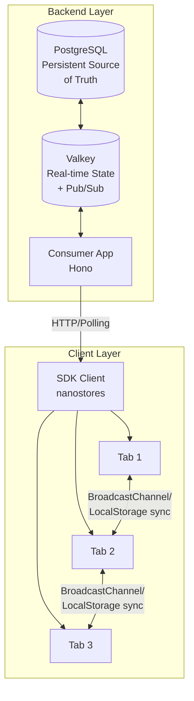

# Real-Time Updates

Fanfare provides real-time state synchronization to ensure consumers always see accurate, up-to-date information. This is critical for high-demand scenarios where queue positions change rapidly, auctions have competing bids, and availability can shift in seconds.

## Architecture Overview

Real-time updates flow through multiple layers:



```
┌────────────────────────────────────────────────────────────────────┐
│                    REAL-TIME ARCHITECTURE                           │
├────────────────────────────────────────────────────────────────────┤
│                                                                    │
│  BACKEND LAYER                                                     │
│  ─────────────                                                     │
│                                                                    │
│  ┌──────────────┐      ┌──────────────┐      ┌──────────────┐     │
│  │  PostgreSQL  │◄────►│    Valkey    │◄────►│ Consumer App │     │
│  │  (persistent │      │  (real-time  │      │   (Hono)     │     │
│  │   source of  │      │   state +    │      │              │     │
│  │   truth)     │      │   pub/sub)   │      │              │     │
│  └──────────────┘      └──────────────┘      └──────┬───────┘     │
│                                                      │             │
│                                                      │ HTTP/       │
│                                                      │ Polling     │
│                                                      │             │
│  CLIENT LAYER                                        ▼             │
│  ────────────                              ┌──────────────────┐    │
│                                            │   SDK Client     │    │
│                                            │   (nanostores)   │    │
│                                            └────────┬─────────┘    │
│                                                     │              │
│                              ┌───────────────┬──────┴──────┐       │
│                              │               │             │       │
│                              ▼               ▼             ▼       │
│                         ┌────────┐      ┌────────┐    ┌────────┐  │
│                         │ Tab 1  │◄────►│ Tab 2  │◄──►│ Tab 3  │  │
│                         └────────┘      └────────┘    └────────┘  │
│                              ▲               ▲             ▲       │
│                              └───────────────┴─────────────┘       │
│                                  BroadcastChannel /                │
│                                  LocalStorage sync                 │
│                                                                    │
└────────────────────────────────────────────────────────────────────┘
```

## Backend State Management

### Valkey (Redis-Compatible)

Valkey serves as the real-time state store for active distributions:

```typescript
// Key patterns for real-time state
const keys = {
  // Queue position tracking
  queuePosition: "queue:{queueId}:positions", // Sorted set
  queueConsumer: "queue:{queueId}:consumer:{consumerId}", // Hash

  // Draw entries
  drawEntries: "draw:{drawId}:entries", // Set
  drawWinners: "draw:{drawId}:winners", // Set

  // Auction state
  auctionBids: "auction:{auctionId}:bids", // Sorted set
  auctionHighBid: "auction:{auctionId}:high_bid", // String

  // Admission tokens
  admissionToken: "admission:{token}", // Hash with TTL

  // Consumer sessions
  consumerSession: "consumer:{consumerId}:session", // Hash
};
```

### State Flow

1. **Write Path**: State changes flow from consumer actions through the API to Valkey
2. **Read Path**: Clients poll or subscribe for state updates
3. **Persistence**: Critical state is persisted to PostgreSQL for durability

```
┌────────────────────────────────────────────────────────────────────┐
│                         STATE FLOW                                  │
├────────────────────────────────────────────────────────────────────┤
│                                                                    │
│  WRITE PATH (Consumer joins queue)                                 │
│  ──────────────────────────────────                                │
│                                                                    │
│  Consumer ──► API ──► Valkey (immediate) ──► PostgreSQL (async)    │
│                          │                                         │
│                          │ Position calculated                     │
│                          │ TTL set on session                      │
│                          ▼                                         │
│                    Response returned                               │
│                                                                    │
│  READ PATH (Consumer checks position)                              │
│  ────────────────────────────────────                              │
│                                                                    │
│  Consumer ◄── API ◄── Valkey                                       │
│                          │                                         │
│                          │ Real-time position                      │
│                          │ Estimated wait time                     │
│                          │ Queue length                            │
│                                                                    │
└────────────────────────────────────────────────────────────────────┘
```

## Client-Side State Synchronization

### SDK Store Architecture

The SDK uses nanostores for lightweight, reactive state management:

```typescript
// Core state synchronized across tabs
const syncedKeys = [
  "session", // Consumer session info
  "activeQueues", // Active queue participations
  "activeDraws", // Active draw entries
  "activeAuctions", // Active auction participations
  "activeJourneys", // Active experience journeys
  "refreshToken", // Authentication token
];
```

### Cross-Tab Synchronization

When a consumer has multiple tabs open, state must stay consistent:

```
┌────────────────────────────────────────────────────────────────────┐
│                    CROSS-TAB SYNC PROTOCOL                          │
├────────────────────────────────────────────────────────────────────┤
│                                                                    │
│  Tab A (Leader)              Tab B                   Tab C         │
│  ─────────────              ─────                   ─────          │
│                                                                    │
│  ┌─────────────┐                                                   │
│  │ State       │                                                   │
│  │ versionMap: │                                                   │
│  │  session: 5 │                                                   │
│  │  queues: 12 │                                                   │
│  └──────┬──────┘                                                   │
│         │                                                          │
│         │◄─────── state:request ────────────────┐                  │
│         │                                       │                  │
│         │ (Leader responds)                     │ (New tab opens)  │
│         │                                       │                  │
│         ├─────── state:response ───────────────►├──────────────────┤
│         │        {session, queues, versions}    │ Apply state     │
│         │                                       │ if version >    │
│         │                                       │ local           │
│         │                                                          │
│         │ (User joins queue in Tab A)                              │
│         │                                                          │
│         ├─────── state:update ─────────────────►├─────────────────►│
│         │        {key: "queues", version: 13}   │                  │
│         │                                       │                  │
│                                                                    │
│  CONFLICT RESOLUTION                                               │
│  ────────────────────                                              │
│                                                                    │
│  • Higher version number wins                                      │
│  • Only leader responds to state requests                          │
│  • Leader broadcasts state on election                             │
│                                                                    │
└────────────────────────────────────────────────────────────────────┘
```

### Transport Layers

The SDK chooses the best available transport:

```typescript
// Priority order for cross-tab communication
const transports = [
  "BroadcastChannel", // Modern browsers, most efficient
  "LocalStorage", // Fallback, uses storage events
];
```

**BroadcastChannel** (preferred):

- Native browser API for same-origin messaging
- Efficient, no storage overhead
- Automatically cleaned up on tab close

**LocalStorage** (fallback):

- Works in older browsers
- Uses `storage` event for notifications
- Requires cleanup of stale entries

## Leader Election

To prevent conflicts, one tab is elected as the leader:

```
┌────────────────────────────────────────────────────────────────────┐
│                      LEADER ELECTION                                │
├────────────────────────────────────────────────────────────────────┤
│                                                                    │
│  PURPOSE                                                           │
│  ───────                                                           │
│  • Single source of truth for state requests                       │
│  • Coordinates API calls to prevent duplicates                     │
│  • Handles recovery when tabs crash                                │
│                                                                    │
│  ELECTION PROCESS                                                  │
│  ─────────────────                                                 │
│                                                                    │
│  1. Tab opens, generates unique tabId                              │
│  2. Tab announces presence via heartbeat                           │
│  3. Tab with lowest tabId becomes leader                           │
│  4. Leader responds to state:request messages                      │
│                                                                    │
│  FAILURE DETECTION                                                 │
│  ─────────────────                                                 │
│                                                                    │
│  • Tabs send periodic heartbeats                                   │
│  • Missing heartbeats → tab marked as dead                         │
│  • Dead leader → new election triggered                            │
│  • New leader broadcasts current state                             │
│                                                                    │
│  ┌───────┐    heartbeat    ┌───────┐    heartbeat    ┌───────┐    │
│  │ Tab A │ ───────────────►│       │◄─────────────── │ Tab C │    │
│  │Leader │◄───────────────►│ Tab B │ ───────────────►│       │    │
│  └───────┘                 └───────┘                 └───────┘    │
│      │                                                    │        │
│      │           Tab A closes                            │        │
│      ▼                                                    ▼        │
│  ┌───────┐                                           ┌───────┐    │
│  │ Dead  │    Tab B has lowest ID → becomes leader   │ Tab C │    │
│  └───────┘                                           │  New  │    │
│                                                      │Follower    │
│                 ┌───────┐                            └───────┘    │
│                 │ Tab B │                                         │
│                 │  New  │                                         │
│                 │Leader │                                         │
│                 └───────┘                                         │
│                                                                    │
└────────────────────────────────────────────────────────────────────┘
```

## Polling and Updates

### Adaptive Polling

The SDK adjusts polling frequency based on context:

```typescript
const pollingStrategies = {
  // High-frequency: Active participation
  activeQueue: {
    interval: 2000, // 2 seconds
    backoff: false,
    conditions: ["status === 'QUEUED'"],
  },

  // Medium-frequency: Waiting for events
  upcomingDraw: {
    interval: 10000, // 10 seconds
    backoff: true,
    conditions: ["status === 'ENTERED'", "drawAt > now + 5min"],
  },

  // Low-frequency: Background monitoring
  admittedSession: {
    interval: 60000, // 1 minute
    backoff: true,
    conditions: ["status === 'ADMITTED'"],
  },
};
```

### State Versioning

Every state update includes a version for conflict resolution:

```typescript
interface StateUpdate {
  key: string;
  value: unknown;
  version: number; // Monotonically increasing
}

// Conflict resolution
function applyUpdate(local: StateUpdate, remote: StateUpdate) {
  if (remote.version > local.version) {
    // Remote is newer, apply it
    return remote;
  } else if (remote.version < local.version) {
    // Local is newer, broadcast it
    broadcastState(local);
    return local;
  }
  // Versions equal, states should match
  return local;
}
```

## SDK Usage

### Subscribing to Real-Time Updates

```typescript
import { useFanfare } from "@waitify-io/fanfare-sdk-react";

function QueuePosition({ queueId }: { queueId: string }) {
  const { queue } = useFanfare();
  const [position, setPosition] = useState<number | null>(null);

  useEffect(() => {
    // Subscribe to position updates
    const unsubscribe = queue.subscribeToPosition(queueId, (data) => {
      setPosition(data.position);
    });

    return unsubscribe;
  }, [queueId]);

  return <div>Your position: {position}</div>;
}
```

### Handling State Changes

```typescript
function AuctionBidding({ auctionId }: { auctionId: string }) {
  const { auction } = useFanfare();
  const [highBid, setHighBid] = useState<string | null>(null);
  const [isOutbid, setIsOutbid] = useState(false);

  useEffect(() => {
    const unsubscribe = auction.subscribe(auctionId, (state) => {
      setHighBid(state.currentHighBid);

      // Check if user was outbid
      if (state.status === "OUTBID") {
        setIsOutbid(true);
      }
    });

    return unsubscribe;
  }, [auctionId]);

  return (
    <div>
      <p>Current High Bid: {highBid}</p>
      {isOutbid && <p className="warning">You have been outbid!</p>}
    </div>
  );
}
```

### Managing Multiple Tabs

```typescript
import { useFanfare } from "@waitify-io/fanfare-sdk-react";

function TabAwareComponent() {
  const { sync } = useFanfare();
  const [isLeader, setIsLeader] = useState(false);
  const [tabCount, setTabCount] = useState(1);

  useEffect(() => {
    // Monitor sync state
    const interval = setInterval(() => {
      setIsLeader(sync.isTabLeader());
      setTabCount(sync.getActiveTabs().length + 1);
    }, 5000);

    return () => clearInterval(interval);
  }, []);

  return (
    <div>
      <p>Open tabs: {tabCount}</p>
      {isLeader && <p>This tab is the leader</p>}
    </div>
  );
}
```

## Recovery and Resilience

### Storage Quota Handling

The SDK handles storage limits gracefully:

```typescript
async function handleStorageQuotaError() {
  // Log the issue
  logger.warn("Storage quota exceeded, cleaning up");

  // Clear old cached data
  await clearStaleCache();

  // Retry the operation
  await retryWithBackoff(operation);
}
```

### Connection Recovery

When connections fail, the SDK automatically recovers:

```typescript
const recoveryStrategy = {
  maxRetries: 3,
  initialDelay: 1000,
  maxDelay: 30000,
  backoffMultiplier: 2,

  onRetry: (attempt, error) => {
    logger.info(`Retry attempt ${attempt}`, { error });
  },

  onMaxRetries: () => {
    logger.error("Max retries reached, falling back to degraded mode");
  },
};
```

### Degraded Mode

If real-time updates fail, the SDK falls back to manual refresh:

```typescript
function DegradedModeNotice() {
  const { sync } = useFanfare();
  const [degraded, setDegraded] = useState(false);

  useEffect(() => {
    if (!sync.isEnabled()) {
      setDegraded(true);
    }
  }, []);

  if (!degraded) return null;

  return (
    <div className="notice">
      <p>Real-time updates unavailable.</p>
      <button onClick={() => window.location.reload()}>Refresh</button>
    </div>
  );
}
```

## Performance Considerations

### Minimizing State Updates

Only sync what's necessary:

```typescript
const syncConfig = {
  // Sync these keys across tabs
  syncKeys: ["session", "activeQueues", "activeDraws"],

  // Don't sync UI state
  excludeKeys: ["uiPreferences", "localDraft"],
};
```

### Debouncing Updates

Prevent excessive updates:

```typescript
// Internal SDK behavior
const updateQueue = createUpdateQueue({
  debounceMs: 100, // Batch updates within 100ms
  maxBatchSize: 10, // Send at most 10 updates per batch
});
```

### Memory Management

Clean up subscriptions properly:

```typescript
function QueueWidget({ queueId }: { queueId: string }) {
  const { queue } = useFanfare();

  useEffect(() => {
    // Subscribe returns cleanup function
    const unsubscribe = queue.subscribe(queueId, handleUpdate);

    // Always clean up on unmount
    return () => {
      unsubscribe();
    };
  }, [queueId]);

  // ...
}
```

## Best Practices

### 1. Handle Stale State

Always assume state might be slightly stale:

```typescript
// Good: Verify before critical actions
const currentState = await queue.refresh(queueId);
if (currentState.status === "ADMITTED") {
  proceedToCheckout();
}

// Bad: Trust cached state for critical decisions
if (cachedState.status === "ADMITTED") {
  proceedToCheckout(); // State might have expired!
}
```

### 2. Show Loading States

Indicate when data is being fetched:

```typescript
function QueueStatus({ queueId }: { queueId: string }) {
  const [loading, setLoading] = useState(true);
  const [position, setPosition] = useState<number | null>(null);

  useEffect(() => {
    queue.getPosition(queueId).then((pos) => {
      setPosition(pos);
      setLoading(false);
    });
  }, [queueId]);

  if (loading) return <Skeleton />;
  return <div>Position: {position}</div>;
}
```

### 3. Provide Manual Refresh

Let users refresh when needed:

```typescript
function RefreshableQueue({ queueId }: { queueId: string }) {
  const [refreshing, setRefreshing] = useState(false);

  const handleRefresh = async () => {
    setRefreshing(true);
    await queue.refresh(queueId);
    setRefreshing(false);
  };

  return (
    <div>
      <QueuePosition queueId={queueId} />
      <button onClick={handleRefresh} disabled={refreshing}>
        {refreshing ? "Refreshing..." : "Refresh"}
      </button>
    </div>
  );
}
```

### 4. Handle Tab Visibility

Pause updates when tab is hidden:

```typescript
useEffect(() => {
  const handleVisibilityChange = () => {
    if (document.hidden) {
      // Reduce polling frequency
      setPollingInterval(30000);
    } else {
      // Restore normal frequency
      setPollingInterval(2000);
      // Immediate refresh on return
      queue.refresh(queueId);
    }
  };

  document.addEventListener("visibilitychange", handleVisibilityChange);
  return () => {
    document.removeEventListener("visibilitychange", handleVisibilityChange);
  };
}, [queueId]);
```

## Related Concepts

- [State Machine](/docs/concepts/state-machine) - Consumer journey states
- [Queue Distribution](/docs/concepts/distributions/queue) - Real-time queue positions
- [Auction Distribution](/docs/concepts/distributions/auction) - Real-time bidding
