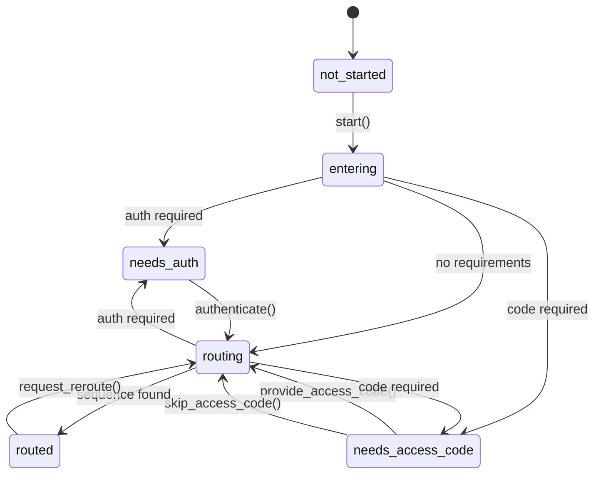
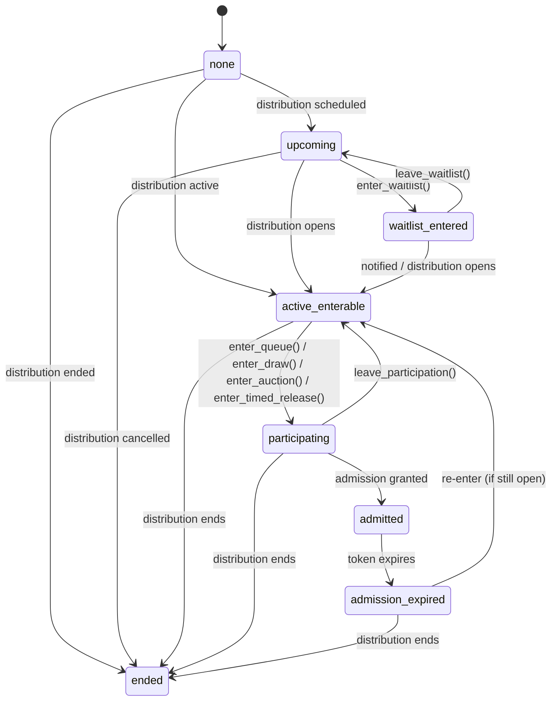

# State Machine

Fanfare uses a hierarchical state machine to model consumer journeys through experiences. Understanding these states helps you build responsive UIs that adapt to where consumers are in their journey.

## State Hierarchy

Consumer state exists at two levels:

1. **Journey Stage** - High-level progress through an experience
2. **Sequence Stage** - Specific position within a sequence's distributions

```
                    CONSUMER STATE HIERARCHY
+----------------------------------------------------------+
|                                                          |
|  JOURNEY STAGE (experience-level)                        |
|  ────────────────────────────────                        |
|  not_started → entering → needs_auth → routing → routed  |
|                           needs_access_code              |
|                                                          |
|  ┌────────────────────────────────────────────────────┐  |
|  │ SEQUENCE STAGE (distribution-level)               │  |
|  │ ─────────────────────────────────                 │  |
|  │ none → upcoming → waitlist_entered                │  |
|  │            ↓                                      │  |
|  │    active_enterable → participating → admitted    │  |
|  │            ↓                                      │  |
|  │         ended                    admission_expired│  |
|  └────────────────────────────────────────────────────┘  |
|                                                          |
+----------------------------------------------------------+
```

## Journey Stage

The journey stage represents where a consumer is in the overall experience flow:

```typescript
type JourneyStage =
  | "not_started" // Consumer has not entered the experience
  | "entering" // In the process of entering
  | "needs_auth" // Authentication required to continue
  | "needs_access_code" // Access code required for sequence
  | "routing" // Being routed to appropriate sequence
  | "routed"; // Successfully routed to a sequence
```

### Journey Stage Flow



```
┌────────────────────────────────────────────────────────────────────┐
│                      JOURNEY STAGE FLOW                             │
├────────────────────────────────────────────────────────────────────┤
│                                                                    │
│  ┌─────────────┐                                                   │
│  │ not_started │ Consumer arrives at experience                    │
│  └──────┬──────┘                                                   │
│         │ start()                                                  │
│         ▼                                                          │
│  ┌─────────────┐                                                   │
│  │  entering   │ Processing entry request                          │
│  └──────┬──────┘                                                   │
│         │                                                          │
│    ┌────┼────────────────┐                                         │
│    │    │                │                                         │
│    ▼    ▼                ▼                                         │
│ ┌──────────┐  ┌───────────────────┐  ┌─────────────┐              │
│ │needs_auth│  │needs_access_code  │  │   routing   │              │
│ └────┬─────┘  └─────────┬─────────┘  └──────┬──────┘              │
│      │                  │                    │                     │
│      │ authenticate()   │ provide_access_    │                     │
│      │                  │ code()             │                     │
│      │                  │                    │                     │
│      └──────────────────┼────────────────────┘                     │
│                         │                                          │
│                         ▼                                          │
│                  ┌─────────────┐                                   │
│                  │   routed    │ Consumer assigned to sequence     │
│                  └─────────────┘                                   │
│                                                                    │
└────────────────────────────────────────────────────────────────────┘
```

### Journey Actions

Actions available depend on current state:

```typescript
type JourneyAction =
  | "start" // Begin the journey
  | "authenticate" // Complete authentication requirement
  | "provide_access_code" // Submit an access code
  | "skip_access_code" // Skip code entry (if allowed)
  | "request_reroute" // Request routing to different sequence
  | "retry" // Retry failed operation
  | "complete_bot_check" // Complete bot verification
  | "refresh_distribution"; // Refresh distribution status
```

## Sequence Stage

Once routed to a sequence, the consumer progresses through sequence stages:

```typescript
type SequenceStage =
  | "none" // Not in any sequence
  | "upcoming" // Distribution not yet open
  | "waitlist_entered" // On waitlist, awaiting notification
  | "active_enterable" // Distribution open, can enter
  | "participating" // Actively participating (in queue, draw, etc.)
  | "admitted" // Has admission token, can proceed to checkout
  | "admission_expired" // Admission token expired
  | "ended"; // Distribution has ended
```

### Sequence Stage Flow



```
┌────────────────────────────────────────────────────────────────────┐
│                     SEQUENCE STAGE FLOW                             │
├────────────────────────────────────────────────────────────────────┤
│                                                                    │
│  ┌─────────┐          ┌───────────────────┐                       │
│  │  none   │─────────►│     upcoming      │ Distribution scheduled │
│  └─────────┘          └─────────┬─────────┘                       │
│                                 │                                  │
│                    ┌────────────┼────────────┐                     │
│                    │            │            │                     │
│                    ▼            │            ▼                     │
│          ┌─────────────────┐    │    ┌───────────────┐            │
│          │waitlist_entered │    │    │active_enterable│◄──────┐   │
│          └────────┬────────┘    │    └───────┬───────┘        │   │
│                   │             │            │                 │   │
│        notify()   │             │            │ enter()         │   │
│                   │             │            │                 │   │
│                   └─────────────┼────────────┤                 │   │
│                                 │            ▼                 │   │
│                                 │    ┌───────────────┐        │   │
│                                 │    │ participating │        │   │
│                                 │    └───────┬───────┘        │   │
│                                 │            │                 │   │
│                                 │     admit()│                 │   │
│                                 │            ▼                 │   │
│                                 │    ┌───────────────┐        │   │
│                                 │    │   admitted    │        │   │
│                                 │    └───┬───────┬───┘        │   │
│                                 │        │       │             │   │
│                                 │ complete() expire()          │   │
│                                 │        │       │             │   │
│                                 │        ▼       ▼             │   │
│                                 │  ┌──────┐ ┌─────────────────┐│   │
│                          end()  │  │(done)│ │admission_expired│┘   │
│                                 │  └──────┘ └─────────────────┘    │
│                                 ▼                                  │
│                          ┌─────────────┐                          │
│                          │    ended    │                          │
│                          └─────────────┘                          │
│                                                                    │
└────────────────────────────────────────────────────────────────────┘
```

### Sequence Actions

Actions available at the sequence level:

```typescript
type SequenceAction =
  | "enter_waitlist" // Join waitlist for upcoming distribution
  | "leave_waitlist" // Leave waitlist
  | "enter_queue" // Enter a queue distribution
  | "enter_draw" // Enter a draw/lottery
  | "enter_auction" // Enter an auction
  | "enter_timed_release" // Enter a timed release
  | "complete_timed_release" // Complete timed release checkout
  | "leave_participation"; // Leave current participation
```

## Distribution-Specific States

Each distribution type has its own consumer status that maps to sequence stages:

### Queue Consumer Status

```typescript
const QueueConsumerStatus = {
  NOT_QUEUED: "NOT_QUEUED", // → active_enterable
  QUEUED: "QUEUED", // → participating
  ADMITTED: "ADMITTED", // → admitted
  COMPLETED: "COMPLETED", // → (done)
  DENIED: "DENIED", // → ended
  LEFT: "LEFT", // → active_enterable (if still open)
} as const;
```

### Draw Consumer Status

```typescript
const DrawConsumerStatus = {
  NOT_ENTERED: "NOT_ENTERED", // → active_enterable
  ENTERED: "ENTERED", // → participating
  WON: "WON", // → admitted
  COMPLETED: "COMPLETED", // → (done)
  DENIED: "DENIED", // → ended (not selected)
} as const;
```

### Auction Consumer Status

```typescript
const AuctionConsumerStatus = {
  BIDDING: "BIDDING", // → participating
  OUTBID: "OUTBID", // → participating (can bid again)
  BID_WON: "BID_WON", // → admitted
  BID_LOST: "BID_LOST", // → ended
  AUCTION_ENDED: "AUCTION_ENDED", // → ended
  RESERVE_MET: "RESERVE_MET", // → participating (bid meets reserve)
  AUCTION_EXTENDED: "AUCTION_EXTENDED", // → participating (time extended)
} as const;
```

### Appointment Consumer Status

```typescript
const AppointmentConsumerStatus = {
  INITIALIZED: "initialized", // → active_enterable
  ENTERED: "entered", // → admitted (slot booked)
  CHECKED_IN: "checked_in", // → (in progress)
  COMPLETED: "completed", // → (done)
} as const;
```

### Waitlist Consumer Status

```typescript
const WaitlistConsumerStatus = {
  WAITING: "WAITING", // → waitlist_entered
  NOTIFIED: "NOTIFIED", // → active_enterable
  CONVERTED: "CONVERTED", // → (done)
} as const;
```

## Requirements System

The journey engine tracks requirements that must be satisfied:

```typescript
type RequirementType = "authentication" | "access_code" | "bot_check";

interface Requirement {
  type: RequirementType;
  required: boolean;
  reason?: string;
  metadata?: Record<string, unknown>;
}
```

Requirements are checked at entry and routing:

```
┌────────────────────────────────────────────────────────────────────┐
│                    REQUIREMENT RESOLUTION                           │
├────────────────────────────────────────────────────────────────────┤
│                                                                    │
│   Consumer enters experience                                       │
│          │                                                         │
│          ▼                                                         │
│   ┌──────────────────┐                                            │
│   │ Check auth       │                                            │
│   │ requirement      │                                            │
│   └────────┬─────────┘                                            │
│            │                                                       │
│    ┌───────┴───────┐                                              │
│    │               │                                              │
│ Required?       No requirement                                     │
│    │               │                                              │
│    ▼               │                                              │
│ needs_auth ────────┼──► authenticate() ────┐                      │
│                    │                        │                      │
│                    ▼                        │                      │
│            ┌──────────────────┐            │                      │
│            │ Check access     │◄───────────┘                      │
│            │ code requirement │                                    │
│            └────────┬─────────┘                                   │
│                     │                                              │
│             ┌───────┴───────┐                                     │
│             │               │                                     │
│          Required?       No requirement                            │
│             │               │                                     │
│             ▼               │                                     │
│    needs_access_code ───────┼──► provide_access_code() ────┐      │
│                             │                               │      │
│                             ▼                               │      │
│                      ┌──────────────┐◄──────────────────────┘      │
│                      │   routing    │                              │
│                      └──────────────┘                              │
│                                                                    │
└────────────────────────────────────────────────────────────────────┘
```

## Journey Snapshot

The complete consumer state is captured in a journey snapshot:

```typescript
interface JourneySnapshot {
  revision: number; // Increments on state change
  updatedAt: number; // Timestamp of last update
  journeyStage: JourneyStage;
  sequenceStage: SequenceStage;
  requirements: Requirement[];
  availableActions: {
    journey: JourneyAction[];
    sequence: SequenceAction[];
  };
  context: JourneyContext;
  events: JourneyEvent[];
  lastSeenEventId?: string;
}
```

### Journey Context

Contains detailed state information:

```typescript
interface JourneyContext {
  experienceId: string;
  experience?: ExperienceSession;
  sequenceId?: string;
  distribution?: DistributionSummary;
  participation?: {
    id: string;
    type: "queue" | "draw" | "auction" | "waitlist" | "timed_release";
  };
  accessCode?: string;
  admittanceToken?: string;
  admittanceExpiresAt?: number;
}
```

## SDK Usage

### Subscribing to State Changes

```typescript
import { useFanfare } from "@waitify-io/fanfare-sdk-react";

function JourneyStatus() {
  const { journey } = useFanfare();
  const [state, setState] = useState<JourneySnapshot | null>(null);

  useEffect(() => {
    // Subscribe to journey state changes
    const unsubscribe = journey.subscribe((snapshot) => {
      setState(snapshot);
    });
    return unsubscribe;
  }, []);

  if (!state) return null;

  return (
    <div>
      <p>Journey: {state.journeyStage}</p>
      <p>Sequence: {state.sequenceStage}</p>
      <p>Available Actions: {state.availableActions.journey.join(", ")}</p>
    </div>
  );
}
```

### Executing Actions

```typescript
function JourneyControls() {
  const { journey } = useFanfare();
  const state = useJourneyState();

  const handleAction = async (action: JourneyAction) => {
    try {
      await journey.execute(action);
    } catch (error) {
      console.error("Action failed:", error);
    }
  };

  return (
    <div>
      {state.availableActions.journey.map((action) => (
        <button key={action} onClick={() => handleAction(action)}>
          {action}
        </button>
      ))}
    </div>
  );
}
```

### Conditional Rendering Based on State

```typescript
function ExperienceView() {
  const state = useJourneyState();

  switch (state.journeyStage) {
    case "not_started":
      return <StartButton />;

    case "needs_auth":
      return <AuthenticationForm />;

    case "needs_access_code":
      return <AccessCodeInput />;

    case "routing":
      return <LoadingSpinner />;

    case "routed":
      return <SequenceView stage={state.sequenceStage} />;

    default:
      return null;
  }
}

function SequenceView({ stage }: { stage: SequenceStage }) {
  switch (stage) {
    case "upcoming":
      return <CountdownTimer />;

    case "waitlist_entered":
      return <WaitlistConfirmation />;

    case "active_enterable":
      return <EnterButton />;

    case "participating":
      return <ParticipationView />;

    case "admitted":
      return <CheckoutButton />;

    case "admission_expired":
      return <ExpiredMessage />;

    case "ended":
      return <EndedMessage />;

    default:
      return null;
  }
}
```

## Journey Events

State changes emit events for tracking and debugging:

```typescript
type JourneyEventKind =
  | "reroute" // Consumer rerouted to different sequence
  | "sequence_change" // Sequence stage changed
  | "distribution_change" // Distribution status changed
  | "requirement" // Requirement added or satisfied
  | "error" // An error occurred
  | "info"; // Informational event

interface JourneyEvent {
  id: string;
  ts: number;
  kind: JourneyEventKind;
  severity: "info" | "success" | "warning" | "error";
  audience: "user" | "system" | "analytics";
  message: string;
  detail?: Record<string, unknown>;
}
```

## Best Practices

### 1. Always Check Available Actions

Before executing an action, verify it's available:

```typescript
function canExecute(action: JourneyAction, state: JourneySnapshot): boolean {
  return state.availableActions.journey.includes(action);
}
```

### 2. Handle State Transitions Gracefully

States can change at any time due to external factors:

```typescript
// Bad: Assuming current state will persist
await delay(5000);
await journey.execute("enter_queue"); // State may have changed!

// Good: Check state before acting
const currentState = journey.getSnapshot();
if (currentState.availableActions.sequence.includes("enter_queue")) {
  await journey.execute("enter_queue");
}
```

### 3. Use Events for Analytics

Track consumer journey for insights:

```typescript
journey.subscribe((snapshot) => {
  const newEvents = snapshot.events.filter((e) => e.audience === "analytics" && e.id !== lastSeenId);

  for (const event of newEvents) {
    analytics.track(event.kind, event.detail);
  }
});
```

### 4. Persist State for Resume

Use journey resume for returning consumers:

```typescript
// Consumer returns to site
const resumeData = await journey.getResumeState();
if (resumeData.journeyStage === "routed") {
  // Continue from where they left off
  await journey.resume(resumeData);
}
```

## Related Concepts

- [Experiences](/docs/concepts/experiences) - Experience configuration and structure
- [Distributions Overview](/docs/concepts/distributions/overview) - Common distribution concepts
- [Real-Time Updates](/docs/concepts/real-time) - How state changes are synchronized
